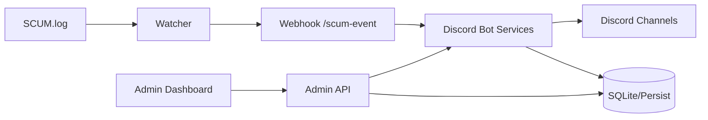

# SCUM TH Bot - Project HQ


เอกสารนี้คือศูนย์กลางข้อมูลของโปรเจกต์ (Single Source of Truth) ใช้แทน `PROJECT_REVIEW.md` และ `docs/SYSTEM_UPDATES.md`

- อัปเดตล่าสุด: **2026-03-12**
- สถานะระบบ: **พร้อมใช้งานจริง (พร้อม checklist production)**
- สรุปผลตรวจล่าสุด: `npm test` ผ่าน (79/79), `npm run lint` ผ่าน
- ไฟล์อ้างอิงหลัก: `README.md`, `src/*`, `test/*`

---

## สารบัญ

- [1) ภาพรวมระบบ](#1-ภาพรวมระบบ)
- [2) สถานะความพร้อมใช้งานจริง](#2-สถานะความพร้อมใช้งานจริง)
- [3) สิ่งที่ทำเสร็จแล้ว (สรุปแบบระบบ)](#3-สิ่งที่ทำเสร็จแล้ว-สรุปแบบระบบ)
- [4) ความปลอดภัย (Security Baseline)](#4-ความปลอดภัย-security-baseline)
- [5) ผลทดสอบล่าสุด](#5-ผลทดสอบล่าสุด)
- [6) Runbook สำหรับใช้งานจริง](#6-runbook-สำหรับใช้งานจริง)
- [7) งานค้าง/แผนต่อไป](#7-งานค้างแผนต่อไป)
- [8) Changelog รวม](#8-changelog-รวม)
- [9) แผนผังไฟล์สำคัญ](#9-แผนผังไฟล์สำคัญ)
- [10) กติกาการอัปเดตเอกสาร](#10-กติกาการอัปเดตเอกสาร)

---

## 1) ภาพรวมระบบ

โปรเจกต์นี้เป็นระบบจัดการเซิร์ฟเวอร์ SCUM ผ่าน Discord Bot + Admin Web โดยมีแกนหลักดังนี้:

- Discord Bot (`src/bot.js`)
- SCUM Log Watcher (`scum-log-watcher.js`)
- Webhook Bridge (`src/scumWebhookServer.js`)
- Admin API + Dashboard (`src/adminWebServer.js`, `src/admin/*`)
- Data Layer (Prisma + SQLite/fallback persistence)
- RCON Delivery Queue + Retry + Audit



---

## 2) สถานะความพร้อมใช้งานจริง

| หมวด | สถานะ | หมายเหตุ |
|---|---|---|
| Economy / Shop / Purchase | พร้อม | รองรับ bundle หลายไอเทม + rollback-safe purchase + partial refund |
| RCON Auto Delivery | พร้อม | queue + retry + audit + observability |
| Rent Bike Daily | พร้อม | 1 ครั้ง/วัน, queue ป้องกันชนกัน, reset รายวัน |
| Tickets / Events / Bounty | พร้อม | ปิด ticket แล้วลบห้องอัตโนมัติ |
| Stats / Kill Feed / Leaderboards | พร้อม | รองรับ kill weapon + distance + hit zone |
| Admin Web | พร้อม | login session, rate limit, live updates |
| SCUM Watcher/Webhook | พร้อม | dedupe + retry + dead-letter |
| Security Hardening | พร้อม baseline | มี checklist production ชัดเจน |
| CI / Lint / Test | พร้อม | check, test, security-check ผ่าน |

---

## 3) สิ่งที่ทำเสร็จแล้ว (สรุปแบบระบบ)

### 3.1 Core Bot Features

- ระบบเศรษฐกิจครบ: wallet, daily, weekly, transfer/gift
- ระบบร้านค้า: buy/inventory, purchase log, refund, mark-delivered
- ระบบตะกร้าสินค้าใช้งานได้จริง (`/cart add|view|remove|clear|checkout`)
- ซื้อสินค้าเดี่ยวและ VIP ผ่าน service กลาง (`shopService`, `vipService`)
- ถ้าสร้าง purchase ล้มหลังตัดเหรียญ ระบบ rollback ให้อัตโนมัติ
- `cart checkout` คืนเหรียญเฉพาะรายการที่สร้าง purchase ไม่สำเร็จ
- welcome pack และวงล้อสุ่มรางวัลใช้ service กลางแบบ rollback-safe
- daily/weekly และ event flow ใช้ service กลาง (`rewardService`, `eventService`) ร่วมกันแล้ว
- ระบบสินค้าแบบ bundle: เพิ่มหลายไอเทมในสินค้าเดียว
- ระบบ Ticket, Event, Bounty, VIP, Redeem
- ระบบ panel command สำหรับโพสต์การ์ด/ปุ่มใช้งาน

### 3.2 Auto Delivery + RCON

- เพิ่ม queue จัดส่งของอัตโนมัติ
- รองรับ retry/backoff เมื่อส่งคำสั่งพลาด
- มี audit log สำหรับตรวจย้อนหลัง
- มี dead-letter queue พร้อม retry/remove เฉพาะรายการ
- มี idempotency guard กัน enqueue/ส่งซ้ำ
- มี watchdog แจ้งเตือน queue ค้างเกิน SLA
- บังคับมาตรฐาน bundle template:
  - สินค้าแบบหลายไอเทมต้องมี `{gameItemId}` หรือ `{quantity}`
  - ถ้าไม่ผ่านจะ reject ตั้งแต่ enqueue
- เพิ่ม runtime health endpoint แยก process (bot/worker/watcher)

### 3.3 SCUM Integration

- watcher parse log ได้หลายรูปแบบ (join/leave/kill/restart)
- kill event รองรับข้อมูลอาวุธ ระยะ และจุดยิง (hit zone)
- dedupe event กัน spam ซ้ำ
- webhook timeout + retry + dead-letter

### 3.4 Rent Motorbike (Daily)

- จำกัดเช่า 1 ครั้ง/วัน/คน
- ทำงานบน queue ทีละคำสั่ง ลดปัญหาแยก vehicle id ผิด
- เก็บสถานะ rental vehicle สำหรับ cleanup
- มีงาน reset รอบวันตาม timezone ที่กำหนด
- ย้าย persistence rent bike เป็น Prisma models (`DailyRent`, `RentalVehicle`)

### 3.5 Admin Web (ปรับ UX แล้ว)

- มีหน้า login แยกจาก dashboard
- หน้า dashboard แยกหมวดชัดเจน ใช้งานง่ายขึ้น
- รองรับธีม SCUM style (เช่น Tactical / Neon)
- ปรับดีไซน์ใหม่โทน SCUM Tactical แบบเต็มหน้า (จัดระเบียบเมนู/ฟอร์มให้อ่านง่ายขึ้น)
- แสดงสถานะกดปุ่มชัดขึ้น และมี feedback runtime
- มี Danger Zone แยก action เสี่ยง
- รองรับ RBAC แบบ `owner/admin/mod` แยกสิทธิ์ตาม endpoint
- รองรับ 2FA (TOTP) และ Discord SSO (เปิดใช้ผ่าน env)
- รองรับ backup/restore snapshot ผ่าน Admin API (owner only)
- route backup/restore/snapshot ถูกแยกไป service layer `src/services/adminSnapshotService.js` แล้ว
- ระบบล็อกอินใช้ฐานข้อมูล `admin_web_users` เป็นแหล่งข้อมูลหลัก (bootstrap จาก env ครั้งแรก)
- มี Audit Center แยกดูย้อนหลัง `wallet / reward / event` พร้อม deep filters `search / user / actor / reason / reference / status / date-from / date-to / window`, exact-match mode (`actor/reference/status`), sort/order, pagination (`page + cursor`) และ saved presets แบบแชร์ผ่าน DB
- export `audit / snapshot / observability` ฝั่ง server สำหรับข้อมูลก้อนใหญ่ ไม่ต้องพึ่ง browser export อย่างเดียว
- dashboard summary cards ถูกแยกเป็น aggregate endpoint `GET /admin/api/dashboard/cards` แล้ว เพื่อลดการพึ่ง snapshot ก้อนใหญ่สำหรับตัวเลขสรุป

### 3.6 Observability + Metrics

- มี time-series metrics ใน dashboard:
  - delivery queue length
  - delivery fail rate
  - admin login failures
  - webhook error rate
- มี metrics filter ตามช่วงเวลา (window) ในหน้า dashboard
- มี alert event สำหรับ queue pressure / fail-rate spike / login-failure spike
- route alert ไป Discord ช่องแอดมินอัตโนมัติ (`ops-alert`)
- มี health endpoint สำหรับ monitor ภายนอก (`GET /healthz`)
- เพิ่ม health endpoint ราย runtime:
  - bot (`BOT_HEALTH_PORT`)
  - worker (`WORKER_HEALTH_PORT`)
  - watcher (`SCUM_WATCHER_HEALTH_PORT`)

### 3.7 Item Icons + Mapping

- รองรับ mapping ชื่อไอเทมกับ icon
- รองรับ fallback เมื่อไม่เจอ icon ตรงชื่อ
- รองรับ normalize alias สำหรับอาวุธ/ไอเทม
- ใช้ได้กับ feed/card ที่เกี่ยวข้อง

---

## 4) ความปลอดภัย (Security Baseline)

### 4.1 สิ่งที่ทำแล้ว

- Admin API
  - session auth + token fallback
  - security headers (CSP / frame / referrer / MIME)
  - origin check + sec-fetch-site guard
  - body size limit
  - token compare แบบ timing-safe
- Webhook
  - บังคับ JSON content-type
  - payload size limit
  - timeout + retry
  - secret verify แบบ timing-safe
  - event type whitelist
- Operational
  - เพิ่ม `npm run security:check`
  - ลดความเสี่ยงจาก token query โดยปิด default

### 4.2 ค่า env ที่ควรมีใน production

```env
SCUM_WEBHOOK_SECRET=<strong-random-secret>
SCUM_WEBHOOK_MAX_BODY_BYTES=65536
SCUM_WEBHOOK_REQUEST_TIMEOUT_MS=10000

ADMIN_WEB_PASSWORD=<strong-random-password>
ADMIN_WEB_TOKEN=<strong-random-token>
ADMIN_WEB_ALLOW_TOKEN_QUERY=false
ADMIN_WEB_ENFORCE_ORIGIN_CHECK=true
ADMIN_WEB_MAX_BODY_BYTES=1048576
ADMIN_WEB_TRUST_PROXY=true
ADMIN_WEB_SECURE_COOKIE=true
ADMIN_WEB_HSTS_ENABLED=true
ADMIN_WEB_HSTS_MAX_AGE_SEC=31536000
ADMIN_WEB_ALLOWED_ORIGINS=https://admin.your-domain.com
```

### 4.3 หมายเหตุความปลอดภัย

ไม่มีระบบใด "กันแฮกได้ 100%" แต่ baseline ปัจจุบันลดความเสี่ยงหลักได้มาก (CSRF, brute-force pressure, payload abuse, weak auth config)

---

## 5) ผลทดสอบล่าสุด

วันที่ยืนยันผล: **2026-03-12**

### คำสั่งที่รันจริง

```bash
npm run check
npm run security:check
```

### ผลลัพธ์

- `npm run lint` ผ่าน
- `npm test` ผ่าน 79/79

### Integration tests ที่มีแล้ว

- purchase -> queue -> auto-delivery success
- bundle template validation (placeholder guard)
- admin API auth + validation
- admin RBAC (owner/mod permission matrix)
- admin live update stream + ticket claim/close full flow (e2e)
- discord interaction full flow (button -> modal -> slash dispatch)
- rentbike full flow (rent -> delivered -> daily-limit -> reset -> cleanup)
- watcher parse หลายรูปแบบ (join/leave/kill/restart)
- webhook auth/dispatch flow
- item icon resolver + fallback
- persistence fallback/required-db guards
- config + delivery non-store persistence write-through to Prisma

---

## 6) Runbook สำหรับใช้งานจริง

### 6.1 ติดตั้งและเริ่มระบบ

```bash
npm install
npm start
node scum-log-watcher.js
```

### 6.2 ลงทะเบียน slash commands

```bash
npm run register-commands
```

### 6.3 ก่อน deploy ทุกครั้ง

- [ ] หมุน secret ที่สำคัญ (admin/webhook/rcon)
- [ ] ตรวจ `.env` ครบและปลอดภัย
- [ ] รัน `npm run check`
- [ ] รัน `npm run security:check`
- [ ] รัน `npm audit --omit=dev`
- [ ] ตั้ง `PERSIST_REQUIRE_DB=true` ใน production หลังย้าย data layer ครบ
- [ ] สำรองข้อมูลก่อนปล่อยจริง

### 6.4 Endpoint สำคัญ

- Admin Web: `http://127.0.0.1:3200/admin/login`
- Observability API: `GET /admin/api/observability`
- SCUM Webhook: `POST /scum-event`

---

## 7) งานค้าง/แผนต่อไป

### 7.1 งานที่ปิดแล้ว

- [x] RBAC ละเอียดขึ้น (`owner/admin/mod`)
- [x] backup/restore ผ่าน admin web
- [x] e2e tests: live update + ticket full flow
- [x] metrics dashboard แบบ time-series
- [x] 2FA/SSO สำหรับ admin login
- [x] P0 เสถียรภาพระบบส่งของ: idempotency + dead-letter retry/remove + watchdog
- [x] P1 observability: filter/window + ops alert route + `/healthz`
- [x] P1 e2e เพิ่มเติม: discord interaction full flow + rentbike full flow + restore drill
- [x] Phase 1 (รอบนี้): wallet ledger + purchase status state machine + admin hardening
- [x] Phase 2 (foundation): player account + steam binding sync + player dashboard API
- [x] Phase 3 (foundation): shared coin service สำหรับ `redeem` และ `bounty`
- [x] Phase 2 (portal): player dashboard UI ฝั่งเว็บจริง + authz แยกจาก admin (`/player`)
- [x] Phase 2 (portal): inventory/catalog query-filter สำหรับ player portal
- [x] Phase 3: รวม `rentbike` + `bounty` + `redeem` ผ่าน service กลาง (`playerOpsService`)
- [x] Phase 3: รวม admin bounty/redeem actions ให้ใช้ service layer เดียวกับ command/web
- [x] Phase 3: รวม admin purchase/welcome actions ให้ใช้ service layer เดียวกับ runtime หลัก
- [x] Phase 3: เพิ่ม Admin Audit Center สำหรับ `wallet / reward / event` พร้อม deep filters (`actor/reference/date-range`), exact-match mode, sort/order, pagination (`page + cursor`), saved presets และ server-side export

### 7.2 งานที่ยังค้าง (ต้องทำต่อ)

#### P0 - ความปลอดภัยก่อนขึ้นจริง

- [x] startup guard (บล็อก config เสี่ยงใน production)
- [x] incident response runbook
- [x] secret generator script
- [x] หมุน `SCUM_WEBHOOK_SECRET`, `ADMIN_WEB_PASSWORD`, `ADMIN_WEB_TOKEN`, `RCON_PASSWORD`
- [ ] หมุน `DISCORD_TOKEN` จาก Discord Developer Portal และอัปเดตใน production env

#### P2 - Data Layer ระยะยาว

- [x] migration checklist + rollback plan (`docs/DATA_LAYER_MIGRATION.md`)
- [x] เพิ่ม `PERSIST_REQUIRE_DB` fail-fast
- [x] เพิ่ม persistence status ใน `/healthz` และ admin snapshot
- [x] เพิ่ม integration tests สำหรับ fallback/required-db mode
- [x] ย้าย `linkStore`, `bountyStore`, `statsStore`, `cartStore`, `redeemStore`, `vipStore`, `scumStore`, `eventStore`, `ticketStore`, `weaponStatsStore`, `welcomePackStore`, `moderationStore`, `giveawayStore`, `topPanelStore`, `deliveryAuditStore` ไป Prisma (cache + startup hydration + write-through)
- [x] ย้าย command/admin write-path เข้าชั้น service และถอด command read-path ออกจาก store direct import ทั้งชุดหลัก
- [x] ย้าย store หลักที่ยังเป็น JSON ไป Prisma แบบ write-through ครบ
- [x] ย้าย persistence นอก store (`config-overrides`, `delivery queue/dead-letter`) ไป Prisma (`BotConfig`, `DeliveryQueueJob`, `DeliveryDeadLetter`)
- [x] ย้าย `luckyWheelStore` และ `partyChatStore` ไป Prisma
- [x] ย้าย rent bike persistence เป็น Prisma model operations (`DailyRent`, `RentalVehicle`)
- [ ] เปิด `PERSIST_REQUIRE_DB=true` ใน production หลัง migration ครบ

#### Phase 2/3 ที่ยังค้าง

- [x] แยก process bot/web/worker ระดับ runtime flags + worker entrypoint + PM2 manifest
- [ ] แยก process bot/web/worker ใน production environment จริง (ปรับ env + deploy + smoke test)
- [ ] รวม domain service กลางไปคำสั่ง/flow อื่นที่เหลือให้ครบทั้งระบบ
- ความคืบหน้า: `/buy`, panel shop buy, player-portal buy, `/cart checkout`, `/vip buy` ถูกย้ายมาใช้ service กลางแล้ว
  - ความคืบหน้าเพิ่ม: admin wallet set/add/remove, admin VIP set/remove, player-portal wheel spin, panel welcome claim ถูกย้ายมาใช้ service กลางแล้ว
- [x] เพิ่ม deployment story ให้แน่น (PM2 + Docker + systemd + reverse proxy example + backup/restore step-by-step)
- [x] เพิ่ม one-click deploy script สำหรับลูกค้า (Windows + PM2)
- [x] เพิ่ม customer onboarding docs แบบ one-click / panel-based

### 7.3 ลำดับทำจริงรอบถัดไป

1. หมุน `DISCORD_TOKEN` จริง แล้ว redeploy ทุก instance
2. ปิด fallback ใน production (`PERSIST_REQUIRE_DB=true`) พร้อม smoke test หลัง deploy
3. แยก process bot/web/worker พร้อม health checks + deploy manifests
4. รวม service กลางเพิ่มเติมให้ครอบคลุม command สำคัญทั้งหมด
5. เพิ่ม integration tests สำหรับ persistence non-store ที่ย้ายล่าสุด (config + delivery queue/dead-letter)

---

## 8) Changelog รวม

### 2026-03-12

- เพิ่ม `src/services/shopService.js`
  - รวม helper ของ shop/bundle summary ไว้จุดเดียว
  - ซื้อสินค้าแบบ rollback-safe ถ้าสร้าง purchase ไม่สำเร็จหลังตัดเหรียญ
- เพิ่ม `src/services/vipService.js`
  - รวม flow ซื้อ VIP และ rollback เมื่อเปิดสิทธิ์ไม่สำเร็จ
- เพิ่ม `src/services/wheelService.js`
  - รวม flow มอบรางวัลวงล้อแบบ rollback-safe
  - rollback `LuckyWheelState` ถ้าการมอบรางวัลเหรียญ/ไอเทมล้ม
- เพิ่ม `src/services/welcomePackService.js`
  - รวม flow รับ welcome pack และ rollback claim ถ้าเครดิตเหรียญล้ม
- เพิ่ม `src/services/rewardService.js`
  - รวม flow รับรางวัล `daily/weekly` ให้ command และ player portal ใช้กติกาเดียวกัน
- เพิ่ม `src/services/eventService.js`
  - รวม flow create/join/start/end event และ reward payout ให้ command กับ admin web ใช้ร่วมกัน
- ปรับ `src/services/playerOpsService.js`
  - เพิ่ม admin helpers สำหรับ `redeem add/delete/reset-usage`
  - ให้ admin bounty/redeem actions ใช้ service layer เดียวกับ command/web
- เพิ่ม `src/services/purchaseService.js`
  - รวม manual purchase status transition ให้ admin web ใช้ state machine กลาง
- ปรับ `src/services/welcomePackService.js`
  - เพิ่ม admin helpers สำหรับ `welcome revoke/clear`
- ปรับ `src/services/cartService.js`
  - ตัดเหรียญครั้งเดียวต่อ checkout
  - คืนเหรียญเฉพาะรายการที่สร้าง purchase ไม่สำเร็จ (`cart_checkout_partial_refund`)
- ย้าย flow มาที่ service กลาง:
  - `/buy`
  - panel shop buy ใน `src/bot.js`
  - player portal buy (`apps/web-portal-standalone/server.js`)
  - `/vip buy`
  - admin wallet set/add/remove
  - admin VIP set/remove
  - admin bounty create/cancel
  - admin redeem add/delete/reset-usage
  - admin purchase status update
  - admin welcome revoke/clear
  - player portal wheel spin
  - panel welcome claim
  - player portal daily/weekly claim
  - admin event create/start/end/join
- เพิ่ม Audit Center ใน `src/admin/dashboard.html`
  - มุมมอง `Wallet Ledger`
  - มุมมอง `Reward History`
  - มุมมอง `Event History`
  - filter คำค้น
  - เลือกช่วงเวลา
  - export `CSV/JSON`
- rewrite command ข้อความไทยให้สะอาดใน:
  - `src/commands/cart.js`
  - `src/commands/vip.js`
  - `src/commands/redeem.js`
  - `src/commands/bounty.js`
  - `src/commands/rentbike.js`
  - `src/commands/gift.js`
  - `src/commands/refund.js`
  - `src/commands/daily.js`
  - `src/commands/weekly.js`
  - `src/commands/event.js`
- เพิ่ม test ใหม่ `test/shop-vip-services.integration.test.js`
- เพิ่ม test ใหม่ `test/reward-services.integration.test.js`
- เพิ่ม test ใหม่ `test/reward-service.integration.test.js`
- เพิ่ม test ใหม่ `test/event-services.integration.test.js`
- เพิ่ม test ใหม่ `test/shop-vip-services.integration.test.js`
  - purchase status service transition + history
- เพิ่ม coverage ให้ `test/admin-api.integration.test.js`
  - wallet add/remove
  - VIP set/remove
  - bounty create/cancel
  - redeem add/reset/delete
  - welcome revoke/clear
- เพิ่ม test ใหม่ `test/player-ops-service.integration.test.js`
  - admin redeem helpers
- ยืนยันผลล่าสุด:
  - `npm run lint` ผ่าน
  - `npm test` ผ่าน `79/79`

### 2026-03-09

- ปรับสคริปต์หมุน secret ให้ใช้ production จริงได้ทันที:
  - `scripts/rotate-production-secrets.js` รองรับการใส่ค่า Discord จริงผ่าน args
    (`--discord-token`, `--portal-discord-secret`, `--admin-sso-discord-secret`)
  - ไม่บังคับเขียน placeholder โดยค่าเริ่มต้นแล้ว (แต่ยังรองรับ `--force-discord-placeholder`)
- ปรับ one-click deploy ให้เข้มขึ้น:
  - `deploy/one-click-production.cmd` รันจาก root อัตโนมัติ
  - เพิ่ม gate `npm run security:check` ก่อนติดตั้ง/มิเกรต/สตาร์ต PM2
  - เปลี่ยนเป็น `npm install` เพื่อให้ `prisma` พร้อมใช้ระหว่าง deploy
- ปรับ runtime split ให้ใช้งานแอดมินได้ครบ:
  - PM2 production/local ตั้ง `BOT_ENABLE_ADMIN_WEB=true`
  - ยังแยก queue/rentbike ออกไป worker ตามเดิม
- ปิด fallback production ที่ data layer ชัดเจนขึ้น:
  - `src/store/_persist.js` บังคับ fail-fast เมื่อ `NODE_ENV=production` แต่ `PERSIST_REQUIRE_DB!=true`
- เพิ่ม security check ฝั่ง player portal:
  - `scripts/security-check.js` โหลด env ของ standalone portal ด้วย
  - ตรวจ `WEB_PORTAL_DISCORD_CLIENT_ID/SECRET` ไม่ให้ว่างหรือ placeholder
- ปรับเอกสาร deployment/onboarding ใหม่ทั้งชุด:
  - `docs/CUSTOMER_ONBOARDING.md`
  - `docs/DEPLOYMENT_STORY.md`
  - `docs/ARCHITECTURE.md`
  - `docs/REPO_PRESENTATION.md`
- แก้ regression test หลังเปิด production env จริง:
  - `test/discord-interaction.e2e.test.js` บังคับ `NODE_ENV=test` ก่อนโหลด `src/bot.js`

- เพิ่ม automation รอบ production hardening:
  - `scripts/rotate-production-secrets.js` (หมุน secret + set production flags ลง `.env` จริง)
  - `deploy/one-click-production.cmd` (rotate -> migrate -> pm2 split runtime -> readiness -> smoke)
  - `npm run security:rotate:prod:dry`
  - `npm run security:rotate:prod`
  - `npm run deploy:oneclick:win`
- เพิ่มคู่มือลูกค้า:
  - `docs/CUSTOMER_ONBOARDING.md` (one-click + panel-based operations)
- เพิ่ม deploy artifacts สำหรับ production เพิ่มเติม:
  - `Dockerfile`
  - `deploy/docker-compose.production.yml`
  - `deploy/systemd/*.service`
  - `deploy/nginx.player-admin.example.conf`
- อัปเดต README ให้รองรับ 3 วิธี deploy ชัดเจน:
  - PM2
  - Docker Compose
  - systemd
- ปิด data-layer migration เพิ่มเติม:
  - เพิ่ม Prisma models/migration สำหรับ `LuckyWheelState`, `PartyChatMessage`, `DailyRent`, `RentalVehicle`
  - ย้าย `src/store/luckyWheelStore.js` ไป Prisma
  - ย้าย `src/store/partyChatStore.js` ไป Prisma
  - ย้าย `src/store/rentBikeStore.js` จาก raw SQL ไป Prisma model operations
  - เพิ่ม backup/restore coverage ของ lucky-wheel และ party-chat ใน admin snapshot
- เพิ่ม runtime health server กลาง `src/services/runtimeHealthServer.js`
  - bot/worker/watcher สามารถเปิด `/healthz` แยกพอร์ตได้
  - อัปเดต PM2 manifests ให้มี health ports (`3210/3211/3212`) และ `PERSIST_REQUIRE_DB=true`
- ปรับ production guard เพิ่ม:
  - production ต้องตั้ง `PERSIST_REQUIRE_DB=true`
  - security-check ปรับให้ fail เมื่อ production ไม่บังคับ DB-only persistence
- เพิ่มเอกสารระบบสำหรับ deploy/presentation:
  - `docs/ARCHITECTURE.md` (runtime split + health matrix)
  - `docs/DEPLOYMENT_STORY.md` (PM2 + reverse proxy + backup/restore step-by-step)
  - `docs/REPO_PRESENTATION.md` (GitHub description/topics/media checklist)
- ทำ readiness verification รอบล่าสุดครบชุด:
  - `npm run check` ผ่าน (57/57)
  - `npm run security:check` ผ่าน
  - `npm run doctor` ผ่าน
  - `npm run doctor:web-standalone` ผ่าน
- เพิ่มสคริปต์ readiness/smoke สำหรับ production:
  - `npm run readiness:full`
  - `npm run readiness:prod`
  - `npm run readiness:prod:audit`
  - `npm run smoke:postdeploy`
  - `deploy/run-production-checks.cmd` (Windows one-shot)
- เพิ่ม hardening ฝั่งเว็บ player portal:
  - ถ้าพอร์ตใช้งานอยู่ (`EADDRINUSE`) จะ `exit(1)` ทันที เพื่อไม่ให้ process ค้างเงียบ
  - กรณี server error อื่น ๆ จะ `exit(1)` เช่นกัน
- ปรับเอกสารให้พร้อมใช้งานจริง:
  - อัปเดต `README.md` เป็นสถานะทดสอบ `57/57`
  - เพิ่มคำสั่ง checklist readiness ก่อนปล่อยจริง
  - เพิ่ม troubleshooting พอร์ตชนใน `apps/web-portal-standalone/README.md`
  - เพิ่มวิธีรัน smoke test หลัง deploy แบบอัตโนมัติ
  - เพิ่มขั้นตอน deploy production ให้เริ่มจาก `.env.production.example`
- ยืนยันว่า doctor production จะ `PASS` เมื่อ override ค่าเป็น production ที่ถูกต้อง
  (`https` + `secure cookie` + `origin check`)

### 2026-03-08

- ปิดงานหลัก Phase 1:
  - เพิ่ม Prisma migration `20260308093000_phase1_wallet_ledger_state_machine`
  - เพิ่ม Prisma migration `20260308123000_cart_entry_store` สำหรับ `CartEntry`
  - เพิ่ม Prisma migration `20260308131500_event_ticket_store` สำหรับ `GuildEvent/GuildEventParticipant/TicketRecord`
  - เพิ่ม Prisma migration `20260308134500_weapon_welcome_store` สำหรับ `WeaponStat/WelcomeClaim`
  - เพิ่ม Prisma migration `20260308143000_moderation_giveaway_top_panel_delivery_audit` สำหรับ `Punishment/Giveaway/GiveawayEntrant/TopPanelMessage/DeliveryAudit`
  - เพิ่ม Prisma migration `20260308170000_config_delivery_persistence` สำหรับ `BotConfig/DeliveryQueueJob/DeliveryDeadLetter`
  - เพิ่มตาราง `WalletLedger`, `PurchaseStatusHistory`, `PlayerAccount`
  - ย้าย store เพิ่มเป็น Prisma write-through: `vip/scum/event/ticket/weaponStats/welcomePack/moderation/giveaway/topPanel/deliveryAudit`
  - ย้าย persistence นอก store ไป Prisma:
    - `src/config.js` -> `BotConfig`
    - `src/services/rconDelivery.js` -> `DeliveryQueueJob` + `DeliveryDeadLetter`
  - เพิ่ม state machine สำหรับสถานะ purchase (`pending/delivering/delivered/delivery_failed/refunded`)
  - บังคับ transition validation ผ่าน `src/services/purchaseStateMachine.js`
  - ทุกการเปลี่ยนสถานะ purchase บันทึก history พร้อม `reason/actor/meta`
  - ทุกการเปลี่ยนยอด wallet ผ่าน ledger audit trail
- Hardening ฝั่ง Admin API:
  - `/admin/api/purchase/status` ตรวจ transition ก่อน update และตอบ `400` พร้อม allowed statuses
  - เพิ่ม `/admin/api/purchase/statuses`
  - เพิ่ม Player APIs:
    - `GET /admin/api/player/accounts`
    - `GET /admin/api/player/dashboard?userId=<discordId>`
    - `POST /admin/api/player/account/upsert`
    - `POST /admin/api/player/steam/bind`
    - `POST /admin/api/player/steam/unbind`
- วางฐาน Phase 2/3:
  - เพิ่ม `src/store/playerAccountStore.js`
  - sync Steam binding จาก `linkStore` ไป `PlayerAccount` อัตโนมัติ
  - เพิ่ม shared `src/services/coinService.js`
  - ย้าย flow `redeem` และ `bounty` มาใช้ coin service กลาง
- ปิดงาน Phase 2/3 เพิ่มเติม:
  - เพิ่ม `src/services/playerOpsService.js` เป็น service กลางสำหรับ `rentbike`/`bounty`/`redeem`
  - ปรับคำสั่ง `/redeem`, `/bounty`, `/rentbike` ให้เรียกผ่าน service กลาง
  - เพิ่ม Player Portal UI จริงที่ `apps/web-portal-standalone/public/player.html`
  - เพิ่ม endpoint ฝั่ง admin สำหรับ player portal:
    - `GET /admin/api/portal/player/dashboard`
    - `GET /admin/api/portal/shop/list`
    - `GET /admin/api/portal/purchase/list`
    - `GET /admin/api/portal/bounty/list`
    - `POST /admin/api/portal/redeem`
    - `POST /admin/api/portal/rentbike/request`
    - `POST /admin/api/portal/bounty/add`
- เดินงานแยก process (Phase 3) เพิ่ม:
  - เพิ่ม runtime flags ใน `src/bot.js` เพื่อเปิด/ปิด service แยกตาม process
  - เพิ่ม worker entrypoint `src/worker.js` (rentbike + delivery worker)
  - เพิ่ม PM2 manifest ตัวอย่าง `deploy/pm2.ecosystem.config.cjs`
  - เพิ่ม env flags แยก bot/worker ใน `.env.example`
- รวม service กลางรอบเพิ่ม:
  - เพิ่ม `setCoinsExact` และ `transferCoins` ใน `src/services/coinService.js`
  - ย้าย flow `/addcoins`, `/removecoins`, `/setcoins`, `/gift`, reward ใน `/event`, และเครดิตใน `/refund` มาใช้ service กลาง
- เพิ่ม worker runtime guard:
  - เพิ่ม `getWorkerRuntimeErrors` และ `assertWorkerEnv` ใน `src/utils/env.js`
  - เพิ่ม test `getWorkerRuntimeErrors` ใน `test/env.test.js`
- เพิ่ม integration tests:
  - `test/wallet-ledger.integration.test.js`
  - `test/player-account.integration.test.js`
  - ขยาย `test/admin-api.integration.test.js` สำหรับ purchase status transition
  - `test/player-ops-service.integration.test.js`
  - `test/admin-portal-api.integration.test.js`
  - `test/cart-redeem-prisma.integration.test.js`
  - `test/vip-event-ticket-scum-prisma.integration.test.js`
  - `test/weapon-welcome-prisma.integration.test.js`
  - `test/moderation-giveaway-top-panel-delivery-audit-prisma.integration.test.js`
  - `test/config-delivery-persistence.integration.test.js`
- ผลทดสอบรอบนี้:
  - `npm run lint` ผ่าน
  - `npm test` ผ่าน `41/41`

### 2026-03-07

- เพิ่มโปรเจคเว็บแยกใหม่ `apps/web-portal-standalone`:
  - Discord OAuth login (`/admin/auth/discord/start` + callback)
  - session + RBAC gate (`owner/admin/mod`)
  - proxy `/admin/api/*` ไป admin API เดิมด้วย `WEB_PORTAL_UPSTREAM_TOKEN`
  - แยก process ออกจากบอทหลัก 100% (ไม่แก้ flow bot runtime เดิม)
  - เพิ่ม production guard + health endpoint + env doctor (`npm run doctor:web-standalone:prod`)
- เดินงาน P2 Data Layer เพิ่ม:
  - ย้าย `src/store/linkStore.js`, `src/store/bountyStore.js`, `src/store/statsStore.js` ให้ใช้ Prisma แบบ write-through
  - เพิ่ม startup hydration จาก Prisma พร้อม fallback โหลด snapshot เดิม
  - เพิ่ม warmup ตอนบอท `ClientReady` (`initLinkStore/initBountyStore/initStatsStore`)
- รีเฟรชเอกสารหลัก:
  - เขียน `README.md` ใหม่เป็น UTF-8 เต็มไฟล์ และอัปเดตสถานะ migration ล่าสุด
- ปิดช่องโหว่การอ่าน request body:
  - เปลี่ยนการตรวจขนาด payload จากตัวอักษรเป็น byte จริงทั้ง `admin-web` และ `scum-webhook`
  - แยกสถานะ error ให้ถูกต้อง (`400` malformed JSON, `413` payload too large)
  - ปรับพฤติกรรมเมื่อ body เกินขนาดให้ drain request โดยไม่ตัด socket ทันที
- Hardening เพิ่มเติมด้านความสุ่ม/ชนกันของรหัส:
  - เปลี่ยนจาก `Math.random()` ไปใช้ `crypto` สำหรับ `purchase code`, `rentbike order id`, `delivery audit id`, และ suffix ticket
  - ปรับสุ่มผู้ชนะ giveaway เป็น Fisher-Yates + `crypto.randomInt`
- เพิ่ม integration tests ด้าน security/runtime:
  - `admin API` ทดสอบ malformed JSON + oversized UTF-8 payload
  - `scum webhook` ทดสอบ malformed JSON + oversized UTF-8 payload
- ยืนยันผลทดสอบรอบนี้:
  - `npm run check` ผ่าน (29/29)
  - `npm run security:check` ผ่าน
  - `npm run doctor` ผ่าน
  - `npm audit --omit=dev` ไม่พบ vulnerability
- Smoke runtime บนเครื่อง:
  - `node src/bot.js` บูตขึ้นและล็อกอิน Discord สำเร็จ (พบพอร์ต `3100`/`3200` ถูกใช้งานอยู่จาก instance เดิม)
  - `node scum-log-watcher.js` เริ่มเฝ้า `SCUM.log` ได้ปกติ
- ปรับเอกสารสถานะใน `PROJECT_HQ.md` ให้เป็นรูปแบบ check-list ชัดเจน:
  - แยกงาน `เสร็จแล้ว` กับ `ค้าง` ตาม P0/P2
  - เพิ่มลำดับทำงานรอบถัดไปแบบ actionable
- ยืนยันผลตรวจล่าสุดซ้ำอีกครั้ง:
  - `npm run check` ผ่าน (27/27)
  - `npm run security:check` ผ่าน
- แก้ mojibake ใน `src/commands/cart.js` ทั้งไฟล์ให้เป็น UTF-8 ไทยล้วน
- เพิ่มคำสั่ง `/panel shop-refresh-buttons`:
  - ใช้ลบปุ่ม `Checkout` แบบเก่าในโพสต์ร้านค้าเดิม (ย้อนหลังตาม limit)
  - ลดปัญหาปุ่มเก่ากดแล้วไม่ตรง flow ใหม่
- อัปเดตหัวข้อ `งานค้าง/แผนต่อไป` เป็น roadmap แบบ `P0/P1/P2` พร้อมลำดับทำงาน
- เพิ่ม production startup guard ใน `src/utils/env.js`
  - ถ้า `NODE_ENV=production` และค่า security baseline ไม่ผ่าน ระบบจะไม่ยอม start
- เพิ่ม script `npm run security:generate-secrets` สำหรับหมุน secret ได้เร็ว
- เพิ่ม runbook `docs/INCIDENT_RESPONSE.md` สำหรับ token leak / webhook abuse / brute-force
- ปิดงาน P0 ความเสถียรระบบส่งของ:
  - เพิ่ม dead-letter queue + retry/remove endpoint
  - เพิ่ม idempotency guard ป้องกันส่งซ้ำ
  - เพิ่ม watchdog alert สำหรับ queue ค้างเกิน SLA
- หมุนค่า secret ใน env สำหรับ webhook/admin/rcon แล้ว (รอหมุน Discord token ทาง portal)
- รีเฟรช slash commands แล้ว (`npm run register-commands`)
- ยืนยันผลตรวจล่าสุด:
  - `npm run lint` ผ่าน
  - `npm test` ผ่าน (27/27)
  - `npm run security:check` ผ่าน
- ปิดงาน P1 observability ฝั่ง production:
  - เพิ่ม query filter สำหรับ `/admin/api/observability` (`windowMs`, `series`)
  - เพิ่มปุ่ม apply window ให้ดึง metrics ตามช่วงเวลาจาก backend
  - เพิ่ม stream event `ops-alert`/`delivery-dead-letter` เข้า live update dashboard
  - เพิ่มส่ง `ops-alert` ไป Discord ช่องแอดมินจากตัวบอท
  - เพิ่ม health endpoint `GET /healthz` สำหรับ external monitor
- เพิ่ม integration assertions สำหรับ backup/restore drill:
  - backup snapshot
  - mutate data
  - dry-run restore
  - live restore และตรวจความถูกต้องของข้อมูลหลัง restore
- แก้ข้อความระบบ rent bike ที่เพี้ยน (mojibake) ให้เป็นข้อความปกติใช้งานจริง
- เพิ่ม `rentbike e2e` ด้วย fake RCON:
  - flow ครบ: rent -> delivered -> daily-limit -> midnight reset -> vehicle cleanup
  - ทดสอบผ่านใน `npm test`
- เพิ่ม `discord interaction e2e` ครบชุด:
  - button `panel-verify-open` -> modal
  - modal `panel-verify-modal` (invalid steam id path)
  - slash command dispatch + execute path
  - แยก `handleInteractionCreate` ออกให้ทดสอบได้โดยไม่ต้อง login bot จริง
- เพิ่ม `PERSIST_REQUIRE_DB` fail-fast ใน `src/store/_persist.js`
  - ถ้าเปิด require mode แล้วหา `sqlite3` ไม่เจอ ระบบจะหยุดทันที
  - ถ้าไม่เปิด require mode จะ fallback เป็น JSON พร้อม reason ชัดเจน
- เพิ่ม persistence observability:
  - `GET /healthz` ส่ง `persistence` status
  - admin snapshot ส่ง `persistence` status
- เพิ่ม persist integration tests:
  - fallback mode เมื่อไม่มี sqlite3
  - required-db mode ต้อง fail fast
- รีดีไซน์หน้า Admin Web / Login ใหม่ทั้งชุดให้โทน SCUM Tactical (ยังคงทุกฟังก์ชันเดิม)
- ปรับระบบล็อกอินแอดมินให้ตรวจสอบผู้ใช้จากฐานข้อมูล `admin_web_users` โดยตรง
  - bootstrap ผู้ใช้เริ่มต้นจาก env เฉพาะตอนเริ่มต้นระบบ
  - เก็บรหัสผ่านเป็น hash แบบ `scrypt`

### 2026-03-06

- รวมเอกสารกระจัดกระจายเป็นไฟล์เดียว `PROJECT_HQ.md`
- ปรับเอกสารให้เป็น UTF-8 ชัดเจน ไม่มีข้อความเพี้ยน
- ยืนยันผลตรวจล่าสุด:
  - `npm run check` ผ่าน
  - `npm run security:check` ผ่าน
- ตั้งกติกาอัปเดตเอกสารให้เขียนที่ไฟล์นี้ไฟล์เดียว
- ปิดงานใหญ่ครบ 5 รายการ:
  - RBAC owner/admin/mod
  - backup/restore ผ่าน admin web
  - e2e tests live update + ticket full flow
  - metrics dashboard แบบ time-series
  - 2FA/SSO สำหรับ admin login
- Hardening รอบล่าสุด:
  - ปรับ `scripts/security-check.js` ให้ตรวจเข้มขึ้น
  - ตรวจว่า `.env` ไม่ถูก track โดย git
  - บังคับเงื่อนไขเพิ่มเมื่อ `NODE_ENV=production`
  - อัปเดต `.gitignore` ให้กันไฟล์ runtime (`data/backups/`, `data/*.json`, `logs/`)
  - ล้าง mojibake ในไฟล์ env และเพิ่ม guard ตรวจ encoding ครอบคลุมมากขึ้น
  - ปรับระบบตะกร้าให้ใช้งานจริง และตัดปุ่ม `ชำระเงิน` ออกจากการ์ดสินค้าใหม่ (คงรองรับข้อความเก่าแบบย้อนหลัง)

### ก่อนหน้า (รอบสำคัญ)

- ปรับ UX admin dashboard ให้จัดหมวดชัด
- เพิ่มระบบ RCON queue + retry + audit
- เพิ่ม rentbike daily flow + cleanup/reset
- เพิ่ม watcher hardening + dedupe/dead-letter
- เพิ่ม integration tests ครอบคลุม flow สำคัญ
- เพิ่ม security hardening สำหรับ admin/webhook

---

## 9) แผนผังไฟล์สำคัญ

- Bot entry: `src/bot.js`
- Admin server: `src/adminWebServer.js`
- Admin UI: `src/admin/dashboard.html`, `src/admin/login.html`
- Webhook server: `src/scumWebhookServer.js`
- Watcher: `scum-log-watcher.js`
- RCON delivery: `src/services/rconDelivery.js`
- Rent bike service: `src/services/rentBikeService.js`
- Config: `src/config.js`
- Tests: `test/*.test.js`
- Security check script: `scripts/security-check.js`

---

## 10) กติกาการอัปเดตเอกสาร

ตั้งแต่ตอนนี้เป็นต้นไป:

- ให้ใช้ไฟล์นี้เป็นไฟล์หลักเพียงไฟล์เดียว
- ทุกครั้งที่อัปเดตระบบ ให้เขียนรายละเอียดในหัวข้อ:
  - What changed
  - Why
  - Impact
  - How tested
- หลีกเลี่ยงแยก changelog ไปหลายไฟล์เพื่อกันข้อมูลไม่ตรงกัน

---

> ไฟล์ `PROJECT_REVIEW.md` และ `docs/SYSTEM_UPDATES.md` ถูกย่อให้เป็นไฟล์ชี้มายัง `PROJECT_HQ.md` เท่านั้น
