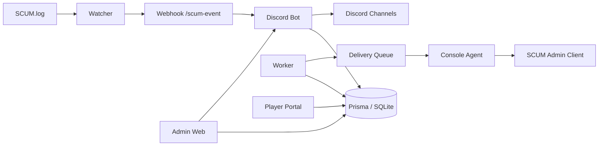

# SCUM TH Bot
SCUM Discord Bot + Admin Web + Player Portal + Delivery Worker


ระบบนี้เป็นแพลตฟอร์มจัดการเซิร์ฟเวอร์ SCUM แบบครบชุดในโปรเจกต์เดียว ประกอบด้วย Discord Bot, Worker, Log Watcher, Admin Web, Player Portal และระบบส่งของอัตโนมัติที่รองรับทั้ง `RCon` และ `agent mode`.

สถานะปัจจุบัน ณ วันที่ **2026-03-13**
- `npm test` ผ่าน `97/97`
- `npm run lint` ผ่าน
- `agent mode` ส่งของจริงผ่าน SCUM admin client ได้แล้ว
- flow ที่ยืนยันใช้งานจริงแล้ว: `announce -> teleport -> spawn -> multi-item -> magazine StackCount`

เอกสารหลัก
- คู่มือปฏิบัติการ: [docs/OPERATIONS_MANUAL_TH.md](./docs/OPERATIONS_MANUAL_TH.md)
- คู่มืออธิบายตัวแปร `.env`: [docs/ENV_REFERENCE_TH.md](./docs/ENV_REFERENCE_TH.md)
- สถานะระบบ/roadmap: [PROJECT_HQ.md](./PROJECT_HQ.md)
- สถาปัตยกรรม: [docs/ARCHITECTURE.md](./docs/ARCHITECTURE.md)

---

## 1. สิ่งที่ระบบทำได้แล้ว

### Discord / Economy
- wallet / balance / transfer / gift
- daily / weekly / welcome pack / wheel reward
- shop / cart / inventory / purchase log
- VIP / redeem / refund
- bounty / event / giveaway / ticket

### SCUM / Server Operations
- watcher อ่าน `SCUM.log` และส่ง event เข้า bot
- kill feed แบบ realtime พร้อม weapon / distance / hit zone / sector
- restart scheduler / restart announce
- rent bike queue + daily limit + midnight reset/cleanup

### Admin / Web
- Admin Web พร้อม RBAC `owner / admin / mod`
- login จาก DB + Discord SSO + 2FA baseline
- config editor / backup / restore / snapshot export
- Audit Center พร้อม filter ลึก, sort/order, pagination, cursor, shared presets
- observability, dashboard cards, metrics export, health endpoints
- player portal แยกที่ `/player`

### Delivery
- queue + retry + dead-letter + audit + watchdog
- split runtime `bot / worker / watcher / web / console-agent`
- preview command จาก `itemId` หรือ `gameItemId`
- fallback command จาก
  - `itemCommands`
  - `scum_weapons_from_wiki.json`
  - `scum_item_category_manifest.json`
- icon mapping จาก `scum_items-main`
- bundle/multi-item delivery ใช้งานได้
- delivery profile รายสินค้า:
  - `spawn_only`
  - `teleport_spawn`
  - `announce_teleport_spawn`
- teleport mode รายสินค้า:
  - `player`
  - `vehicle`
- magazine auto modifier:
  - `Magazine_...` -> เติม `StackCount 100` อัตโนมัติ ถ้า template ยังไม่ใส่มาเอง

---

## 2. สภาพระบบส่งของปัจจุบัน

ระบบส่งของรองรับ 2 โหมด

### 2.1 RCon mode
ใช้เมื่อเซิร์ฟเวอร์ SCUM รับ `#SpawnItem` ผ่าน remote command ได้จริง

ใช้ค่า env หลัก
- `DELIVERY_EXECUTION_MODE=rcon`
- `RCON_HOST`
- `RCON_PORT`
- `RCON_PASSWORD`
- `RCON_PROTOCOL=source|battleye`

### 2.2 Agent mode
ใช้เมื่อ `BattlEye login ได้ แต่ #SpawnItem ไม่ execute`

flow ที่ใช้จริงตอนนี้:

```text
Purchase
-> Delivery Queue
-> Worker
-> Console Agent
-> PowerShell Bridge
-> SCUM Admin Client
-> Admin Channel Command
```

โหมดนี้เป็นโหมดที่ยืนยันใช้งานจริงแล้วในเครื่องปัจจุบัน

สิ่งที่ยืนยันแล้ว
- `#Announce ...`
- `#TeleportToVehicle 50118`
- `#SpawnItem Weapon_M1911 1`
- multi-item delivery หลายคำสั่งต่อเนื่อง
- magazine spawn พร้อม `StackCount 100`

ข้อจำกัดของ agent mode
- ต้องเปิด SCUM client ค้างไว้ด้วยบัญชีแอดมิน
- ต้องอยู่ในเซิร์ฟเวอร์
- Windows session ต้องไม่ lock
- ช่องคำสั่งต้องเป็น admin channel ที่ script จับได้ถูก

---

## 3. สถาปัตยกรรมย่อ



runtime ที่ควรแยกจริง
- `bot`
- `worker`
- `watcher`
- `admin web`
- `player portal`
- `console agent`

---

## 4. Quick Start

### Windows แบบเร็ว

```bash
npm run setup:easy
```

สคริปต์จะช่วย
- copy env template
- ติดตั้ง dependencies
- generate Prisma client
- db push

### ติดตั้งเองแบบ manual

```bash
npm install
copy .env.example .env
npm run doctor
```

ถ้าจะขึ้น production

```bash
copy .env.production.example .env
```

---

## 5. ค่า `.env` สำคัญ

### Discord

```env
DISCORD_TOKEN=
DISCORD_CLIENT_ID=
DISCORD_GUILD_ID=
```

### Database

```env
DATABASE_URL="file:./prisma/dev.db"
PERSIST_REQUIRE_DB=true
PERSIST_LEGACY_SNAPSHOTS=false
```

### Watcher / Webhook

```env
SCUM_LOG_PATH=C:\\Path\\To\\SCUM.log
SCUM_WEBHOOK_PORT=3100
SCUM_WEBHOOK_SECRET=
SCUM_WEBHOOK_URL=http://127.0.0.1:3100/scum-event
```

### Runtime split ที่แนะนำ

```env
BOT_ENABLE_SCUM_WEBHOOK=true
BOT_ENABLE_RESTART_SCHEDULER=true
BOT_ENABLE_ADMIN_WEB=true
BOT_ENABLE_RENTBIKE_SERVICE=false
BOT_ENABLE_DELIVERY_WORKER=false
BOT_ENABLE_OPS_ALERT_ROUTE=true

WORKER_ENABLE_RENTBIKE=true
WORKER_ENABLE_DELIVERY=true
```

### Agent mode ที่ใช้งานจริงตอนนี้

```env
DELIVERY_EXECUTION_MODE=agent

SCUM_CONSOLE_AGENT_BASE_URL=http://127.0.0.1:3213
SCUM_CONSOLE_AGENT_HOST=127.0.0.1
SCUM_CONSOLE_AGENT_PORT=3213
SCUM_CONSOLE_AGENT_TOKEN=put_a_strong_agent_token_here
SCUM_CONSOLE_AGENT_BACKEND=exec
SCUM_CONSOLE_AGENT_COMMAND_TIMEOUT_MS=15000
SCUM_CONSOLE_AGENT_ALLOW_NON_HASH=false

DELIVERY_AGENT_PRE_COMMANDS_JSON=["#TeleportToVehicle {teleportTargetRaw}"]
DELIVERY_AGENT_POST_COMMANDS_JSON=[]
DELIVERY_AGENT_COMMAND_DELAY_MS=600
DELIVERY_AGENT_POST_TELEPORT_DELAY_MS=2000
DELIVERY_MAGAZINE_STACKCOUNT=100
DELIVERY_AGENT_TELEPORT_MODE=vehicle
DELIVERY_AGENT_TELEPORT_TARGET=50118
DELIVERY_AGENT_RETURN_TARGET=

SCUM_CONSOLE_AGENT_EXEC_TEMPLATE=powershell -NoProfile -ExecutionPolicy Bypass -File scripts/send-scum-admin-command.ps1 -WindowTitle "SCUM" -SwitchToAdminChannel -AdminChannelTabs 3 -Command "{command}"
```

### ความหมายของค่าหลักใน delivery
- `DELIVERY_AGENT_COMMAND_DELAY_MS`
  - delay ปกติระหว่างคำสั่ง
- `DELIVERY_AGENT_POST_TELEPORT_DELAY_MS`
  - delay หลัง teleport ก่อนเริ่ม spawn
- `DELIVERY_MAGAZINE_STACKCOUNT`
  - ถ้า item เป็น `Magazine_...` ระบบจะเติม `StackCount` ให้
- `DELIVERY_AGENT_TELEPORT_TARGET`
  - จุดส่งของคงที่ เช่นรถ id/alias

---

## 6. การรันระบบ

### รันแยก process

```bash
npm run start:bot
npm run start:worker
npm run start:watcher
npm run start:scum-agent
npm run start:web-standalone
```

### รันด้วย PM2

```bash
npm run pm2:start:local
```

production

```bash
npm run pm2:start:prod
```

Windows helpers
- `deploy\start-production-stack.cmd`
- `deploy\reload-production-stack.cmd`
- `deploy\stop-production-stack.cmd`

---

## 7. การทดสอบระบบส่งของ

### preview command

```bash
npm run preview:spawn -- --game-item-id Weapon_M1911 --quantity 1
```

### ยิงคำสั่งผ่าน agent ตรง ๆ

```bash
npm run scum:agent:exec -- --command "#Announce HELLO"
npm run scum:agent:exec -- --command "#TeleportToVehicle 50118"
npm run scum:agent:exec -- --command "#SpawnItem Weapon_M1911 1"
npm run scum:agent:exec -- --command "#SpawnItem Magazine_M1911 1 StackCount 100"
```

### พรีวิวคำสั่งส่งของจากระบบจริง
ใช้หน้าแอดมินแท็บ `Delivery Preview`

### ทดสอบ multi-item
ตัวอย่างที่ยืนยันแล้ว:

```text
#TeleportToVehicle 50118
#SpawnItem Weapon_M1911 1
#SpawnItem Magazine_M1911 2 StackCount 100
#SpawnItem Cal_45_Ammobox 1
```

---

## 8. Admin Web

ความสามารถหลัก
- config editor
- delivery runtime
- delivery preview
- queue / dead-letter / detail / command log
- wallet / reward / event audit
- deep filters + exact filters + sort/order + pagination + cursor
- shared presets ผ่าน DB (`private / role / public`)
- export
  - `audit`
  - `snapshot`
  - `observability`
- dashboard cards aggregate endpoint พร้อม cache window

เส้นทางหลัก
- `http://127.0.0.1:3200/admin`
- production ปัจจุบันอ้างอิงโดเมน `https://genz.noah-dns.online/admin`

---

## 9. Player Portal

เส้นทางหลัก
- `http://127.0.0.1:3300/player`
- production ปัจจุบันอ้างอิงโดเมน `https://genz.noah-dns.online`

รองรับ
- Discord login
- profile / steam link
- dashboard
- wallet / purchase history
- shop / redeem
- rent bike / reward / leaderboard บางส่วน

---

## 10. Item / Icon / Command Mapping

แหล่งข้อมูลหลัก
- [scum_weapons_from_wiki.json](./scum_weapons_from_wiki.json)
- [scum_item_category_manifest.json](./scum_item_category_manifest.json)
- [scum_items-main/index.json](./scum_items-main/index.json)

ลำดับ resolve command
1. `delivery.auto.itemCommands`
2. wiki weapon fallback
3. manifest fallback

ลำดับ resolve icon
1. `scum_items-main/index.json`
2. alias/canonical normalization
3. directory fallback

---

## 11. การตรวจสุขภาพ / readiness

```bash
npm run doctor
npm run doctor:topology
npm run doctor:web-standalone
npm run security:check
npm run readiness:prod
npm run smoke:postdeploy
```

health endpoint ที่มี
- bot
- worker
- watcher
- console agent

---

## 12. ผลทดสอบล่าสุด

ล่าสุดที่รันจริง:

```bash
npm run lint
npm test
```

ผลล่าสุด
- `npm run lint` ผ่าน
- `npm test` ผ่าน `97/97`

---

## 13. ข้อควรระวัง production

- หมุน token/secret จริงทั้งหมดก่อนเปิดใช้งาน
- ถ้าใช้ `agent mode` อย่า lock session Windows
- อย่ารัน SCUM server หลาย instance ใช้ save path เดียวกัน
- ถ้าจะแยก `bot/worker` จริง อย่าเปิด delivery ทั้งสองฝั่งพร้อมกัน
- production ควรใช้:
  - `NODE_ENV=production`
  - `PERSIST_REQUIRE_DB=true`
  - `PERSIST_LEGACY_SNAPSHOTS=false`

---

## 14. เอกสารเสริม

- คู่มือปฏิบัติการเต็ม: [docs/OPERATIONS_MANUAL_TH.md](./docs/OPERATIONS_MANUAL_TH.md)
- สถานะระบบ/roadmap: [PROJECT_HQ.md](./PROJECT_HQ.md)
- deployment story: [docs/DEPLOYMENT_STORY.md](./docs/DEPLOYMENT_STORY.md)
- customer onboarding: [docs/CUSTOMER_ONBOARDING.md](./docs/CUSTOMER_ONBOARDING.md)
