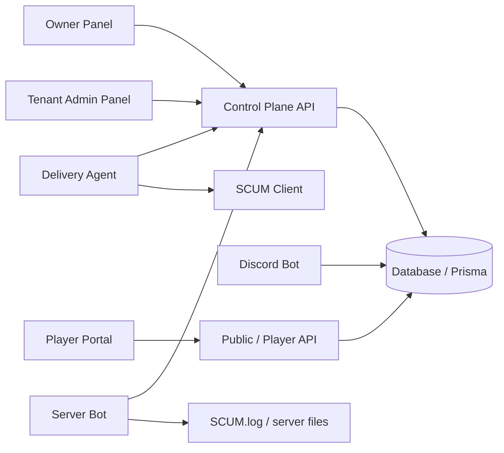

# SCUM TH Platform

[](https://github.com/kogawz1997/Scum-bot-discord-Full-/actions/workflows/ci.yml)
[](https://github.com/kogawz1997/Scum-bot-discord-Full-/actions/workflows/release.yml)


อัปเดตล่าสุด: **2026-04-25**

เครดิตโปรเจค: `KOGA.EXE`

SCUM TH Platform คือระบบจัดการเซิร์ฟเวอร์ SCUM แบบ control plane สำหรับทำเป็นบริการดูแลหลายชุมชนในอนาคต เป้าหมายคือให้เจ้าของระบบดูภาพรวมทั้งหมดได้ ส่วนแอดมินของแต่ละเซิร์ฟจัดการงานประจำวันได้ และผู้เล่นมีหน้าเว็บของตัวเองสำหรับร้านค้า สถานะบัญชี และข้อมูลในเกม

สถานะจริงตอนนี้คือ **Managed-Service Prototype ที่เริ่มมี backend จริงหลายส่วนแล้ว** แต่ยังไม่ควรเรียกว่า SaaS พร้อมขายเต็มรูปแบบ เพราะบาง flow ยังต้องใช้ environment จริง, runtime agent, payment provider, และหลักฐาน production เพิ่มเติม

## ภาพรวมระบบ

ระบบแบ่งออกเป็น 3 หน้าเว็บหลัก:

- `Owner Panel` สำหรับเจ้าของแพลตฟอร์ม ดูลูกค้า package billing runtime incident diagnostics และ security
- `Tenant Admin Panel` สำหรับแอดมินของแต่ละเซิร์ฟ จัดการ config restart delivery bot และงานหน้าบ้านของเซิร์ฟ
- `Player Portal` สำหรับผู้เล่น ดูโปรไฟล์ ร้านค้า ออเดอร์ wallet และข้อมูลที่เกี่ยวกับบัญชีผู้เล่น

runtime แยกเป็น 2 บทบาทชัดเจน:

- `Delivery Agent` รันบนเครื่องที่เปิด SCUM client ใช้ทำงานส่งของและประกาศในเกม
- `Server Bot` รันฝั่งเครื่องเซิร์ฟเวอร์ ใช้อ่าน `SCUM.log`, sync สถานะ, แก้ config, backup และสั่ง restart/start/stop

> ข้อสำคัญ: `Delivery Agent` กับ `Server Bot` ไม่ใช่ตัวเดียวกัน และ UI/API ต้องแยกบทบาทนี้เสมอ




## สิ่งที่ใช้งานได้แล้ว

- มี backend/control plane สำหรับ owner หลายชุด เช่น tenants, packages, subscriptions, billing, runtime registry, provisioning, diagnostics, notifications, backup และ security
- ฝั่ง Owen/Owner web ตอนนี้ให้ถือว่า prototype UI เป็นเว็บหลักของ Owner Panel โดยรันผ่าน `apps/owner-ui-prototype` และเสิร์ฟที่ `http://127.0.0.1:3202/owner`
- ไฟล์ prototype/design ใน `owen scum/` และ `น/` เป็นแหล่งอ้างอิงของหน้าหลัก Owen/Owner ไม่ใช่ไฟล์ทิ้ง
- Owner UI เชื่อมกับ `/owner/api/*` เป็น contract หลัก และ backend map กลับไปยัง route ฝั่ง control plane
- มี runtime API สำหรับ agent เช่น register, activate, heartbeat, session, sync, config snapshot, config jobs และ delivery reconcile
- มีระบบ package/feature gating และ quota ที่เริ่มต่อกับ backend จริง
- มี billing lifecycle, invoices, payment attempts และ checkout-session tooling ใน backend แต่การใช้งาน provider จริงต้องตั้งค่า env ให้ครบ
- มี tenant/server registry, staff/role, server-discord link และ runtime binding model
- มี diagnostics/export/support evidence หลายจุดสำหรับ owner/support workflow
- มี backup/restore status/history และ restore guardrail บางส่วน
- มี audit/security events/session/auth provider routes
- มี test และ script ตรวจระบบจำนวนมาก เช่น `doctor`, `security:check`, `readiness`, `smoke`, `lint`, `test`

## สิ่งที่ยังต้องระวัง

- โปรเจคนี้ยังมีทั้งส่วนที่ implemented, partial, scaffold และ placeholder ปนกัน ต้องดูจาก code/test/runtime evidence ไม่ใช่ดูจากชื่อหน้าอย่างเดียว
- donation, event, module, raid, leaderboard, killfeed และ player commerce บาง flow ยังต้องตรวจแบบ end-to-end เพิ่มก่อนใช้ขายจริง
- payment provider ภายนอกต้องมี env และ webhook ที่ตั้งค่าจริง
- restart/config flow ต้องมี `Server Bot` online และดึง job ไปทำจริง
- delivery flow ต้องมี `Delivery Agent` online บนเครื่องที่เปิด SCUM client จริง
- i18n ยังต้องเก็บให้เป็นระบบทั้ง Owner/Tenant/Player โดยเฉพาะข้อความไทยใน UI และ Discord notification
- production readiness ยังต้องพิสูจน์เรื่อง tenant isolation, rate limit, monitoring, alerting, backup restore และ incident workflow ใน environment จริง

## URL ที่ใช้บ่อยตอนพัฒนา

- Owner Panel: `http://127.0.0.1:3202/owner`
- Tenant Admin Panel: `http://127.0.0.1:3202/tenant` หรือ port ตาม env ที่รันอยู่
- Player Portal: `http://127.0.0.1:3300/player`
- Admin/control API: `http://127.0.0.1:3200`
- Owner API contract: `/owner/api/*`
- Runtime machine API: `/platform/api/v1/*`

## เริ่มต้นเร็ว

ติดตั้งและเตรียมเครื่องบน Windows:

```bash
npm run setup:easy
```

เตรียม PostgreSQL local:

```bash
npm run postgres:local:setup
npm run db:generate:postgresql
npm run db:migrate:deploy:postgresql
```

รันชุด local runtime ตาม config:

```bash
npm run pm2:start:local
pm2 status
```

เช็คสภาพระบบ:

```bash
npm run doctor
npm run security:check
npm run readiness:prod
```

รัน test หลัก:

```bash
npm test
```

## เอกสารสำคัญ

- Owner API/backend map: [docs/OWNER_API_BACKEND_MAP_TH.md](./docs/OWNER_API_BACKEND_MAP_TH.md)
- Owner API detailed reference: [docs/OWNER_API_DETAILED_REFERENCE_TH.md](./docs/OWNER_API_DETAILED_REFERENCE_TH.md)
- Readiness audit: [docs/MANAGED_SERVICE_READINESS_AUDIT_2026-04-22_TH.md](./docs/MANAGED_SERVICE_READINESS_AUDIT_2026-04-22_TH.md)
- Release baseline: [docs/RELEASE_BASELINE_2026-04-22_TH.md](./docs/RELEASE_BASELINE_2026-04-22_TH.md)
- Operator quickstart: [docs/OPERATOR_QUICKSTART.md](./docs/OPERATOR_QUICKSTART.md)
- Architecture: [docs/ARCHITECTURE.md](./docs/ARCHITECTURE.md)
- Runtime topology: [docs/RUNTIME_TOPOLOGY.md](./docs/RUNTIME_TOPOLOGY.md)
- Package and agent model: [docs/PLATFORM_PACKAGE_AND_AGENT_MODEL.md](./docs/PLATFORM_PACKAGE_AND_AGENT_MODEL.md)
- Product gap matrix: [docs/PRODUCT_READY_GAP_MATRIX.md](./docs/PRODUCT_READY_GAP_MATRIX.md)
- Security policy: [SECURITY.md](./SECURITY.md)

## สถานะความพร้อมแบบตรงไปตรงมา

ตอนนี้เหมาะกับ:

- ใช้เป็นระบบ internal/control plane สำหรับทีมที่รู้ข้อจำกัด
- ใช้ demo owner/tenant/player direction
- ใช้ต่อยอดเป็น managed service จริง
- ใช้เป็นฐาน backend/API สำหรับทำ UI ใหม่ให้ต่อกับของจริง

ตอนนี้ยังไม่เหมาะกับ:

- เปิดขายเป็น SaaS สาธารณะทันที
- ให้ลูกค้าใช้งานเองแบบ self-service โดยไม่มีทีมดูแล
- รับเงิน production แบบไม่มี payment/webhook/backup/monitoring proof ครบ
- สัญญา SLA หรือ recovery guarantee

## แนวทางพัฒนาต่อ

ลำดับงานที่ควรทำก่อนขายจริง:

1. ยืนยัน tenant isolation, permission และ audit log ทุก mutation
2. ทำ Owner/Tenant/Player UI ให้ใช้ API contract เดียวกันและมี locked/empty/error state ครบ
3. พิสูจน์ Delivery Agent และ Server Bot ในเครื่องจริงหลายแบบ
4. ปิด flow billing/subscription/trial/preview ให้ครบ
5. เก็บ donation, event, module, raid, stats และ player portal ให้ผ่าน end-to-end
6. ทำ i18n ไทย/อังกฤษแบบใช้ translation key ไม่ใช่ hardcode
7. ทำ monitoring, alert, backup restore และ incident runbook ให้พร้อมใช้งานจริง

## หมายเหตุสำหรับคนอ่านโปรเจค

ถ้าข้อความใน repo ไม่มี code, test, CI artifact หรือ runtime log รองรับ ให้ถือว่าเป็นบริบทหรือแผนงาน ไม่ใช่หลักฐานว่าระบบเสร็จแล้ว
