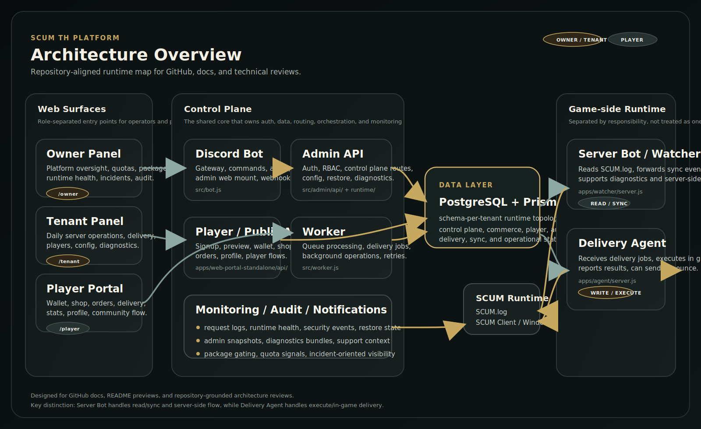

# SCUM TH Platform

Language:

- English: [README.md](./README.md)
- Thai: `README_TH.md`

อัปเดตล่าสุด: **2026-03-31**

SCUM TH Platform เป็น control plane สำหรับแพลตฟอร์มชุมชน SCUM ที่รวม:

- Owner Panel
- Tenant Admin Panel
- Player Portal
- Discord bot
- Worker runtime
- Watcher runtime
- Delivery Agent
- Server Bot

หมายเหตุของเครื่องนี้ ณ `2026-03-31`:

- PostgreSQL local ทำงานที่ `127.0.0.1:55432`
- runtime หลักใน PM2 ขึ้นครบตามชุดที่ใช้ทดสอบ
- admin login local ถูกตรวจซ้ำแล้ว
- health endpoint ของ bot และ server bot ตอบกลับได้
- อย่าตีความว่าระบบส่วน commercial billing, unified identity, donations, raids, modules, analytics หรือ Discord admin SSO เสร็จสมบูรณ์แล้ว ให้ดู [PROJECT_HQ.md](./PROJECT_HQ.md) และ [docs/VERIFICATION_STATUS_TH.md](./docs/VERIFICATION_STATUS_TH.md) เพิ่ม

ถ้าใน repo มีข้อความใดที่ไม่มีโค้ด, tests, CI artifacts หรือ runtime logs รองรับ ให้ถือเป็น supporting context ไม่ใช่ evidence

## ภาพรวมระบบ

สำหรับ system map แบบ render บน GitHub:

- ไทย: [docs/SYSTEM_MAP_GITHUB_TH.md](./docs/SYSTEM_MAP_GITHUB_TH.md)
- อังกฤษ: [docs/SYSTEM_MAP_GITHUB_EN.md](./docs/SYSTEM_MAP_GITHUB_EN.md)



โดยสรุป:

- `Owner Panel` ใช้ดูแลภาพรวมแพลตฟอร์ม
- `Tenant Panel` ใช้ทำงานปฏิบัติการรายเซิร์ฟเวอร์
- `Player Portal` ใช้สำหรับผู้เล่นและ commerce
- `Server Bot / Watcher` ใช้อ่าน log และ sync state
- `Delivery Agent` ใช้ execute งานในเกม
- ทุกอย่างรวมเข้าที่ control plane และบันทึกผ่าน `PostgreSQL + Prisma`

## เอกสารหลัก

- ดัชนีเอกสาร: [docs/README.md](./docs/README.md)
- ดัชนีรายละเอียดโปรเจกต์: [docs/PROJECT_DETAIL_FILE_INDEX_README.md](./docs/PROJECT_DETAIL_FILE_INDEX_README.md)
- คู่มือ operator: [docs/OPERATOR_QUICKSTART.md](./docs/OPERATOR_QUICKSTART.md)
- เส้นทาง setup เร็ว: [docs/FIFTEEN_MINUTE_SETUP.md](./docs/FIFTEEN_MINUTE_SETUP.md)
- สรุปสถานะระบบ: [PROJECT_HQ.md](./PROJECT_HQ.md)
- สถานะ verification: [docs/VERIFICATION_STATUS_TH.md](./docs/VERIFICATION_STATUS_TH.md)
- gap matrix: [docs/PRODUCT_READY_GAP_MATRIX.md](./docs/PRODUCT_READY_GAP_MATRIX.md)
- สถาปัตยกรรม: [docs/ARCHITECTURE.md](./docs/ARCHITECTURE.md)
- runtime topology: [docs/RUNTIME_TOPOLOGY.md](./docs/RUNTIME_TOPOLOGY.md)
- package และ agent model: [docs/PLATFORM_PACKAGE_AND_AGENT_MODEL.md](./docs/PLATFORM_PACKAGE_AND_AGENT_MODEL.md)

## สิ่งที่ทำงานได้แล้ว

- runtime แยกหลาย role ชัดเจน
- PostgreSQL เป็น runtime หลักของเครื่องนี้
- Owner, Tenant, Player surfaces ใช้งานได้
- preview flow, package gating, config flow, restart flow มีของจริง
- monitoring, audit, notifications, delivery lifecycle, และ runtime health มีหลักฐานใน repo

## สิ่งที่ยัง partial

- commercial depth ยังต้องพิสูจน์เพิ่ม
- identity/account center ยังไม่ใช่เส้นเดียวทั้งหมด
- i18n และ product polish ยังมีหนี้
- external proof นอกเครื่องนี้ยังต้องเก็บเพิ่ม

## เริ่มต้นเร็ว

บน Windows:

```bash
npm run setup:easy
```

เตรียม PostgreSQL local:

```bash
npm run postgres:local:setup
npm run db:generate:postgresql
npm run db:migrate:deploy:postgresql
```

เช็กสภาพระบบ:

```bash
npm run doctor
npm run security:check
npm run readiness:prod
```

## ดูต่อ

- [docs/README.md](./docs/README.md)
- [docs/PROJECT_DETAIL_FILE_INDEX_TH.md](./docs/PROJECT_DETAIL_FILE_INDEX_TH.md)
- [docs/OPERATOR_QUICKSTART.md](./docs/OPERATOR_QUICKSTART.md)
- [docs/EVIDENCE_MAP_TH.md](./docs/EVIDENCE_MAP_TH.md)
