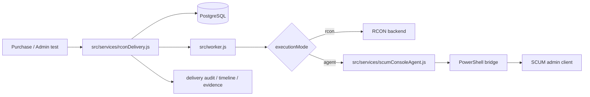
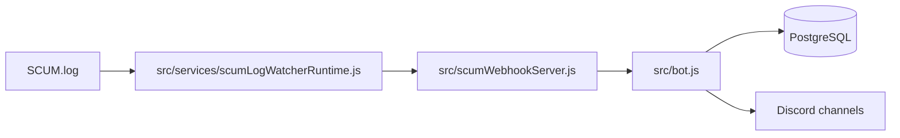
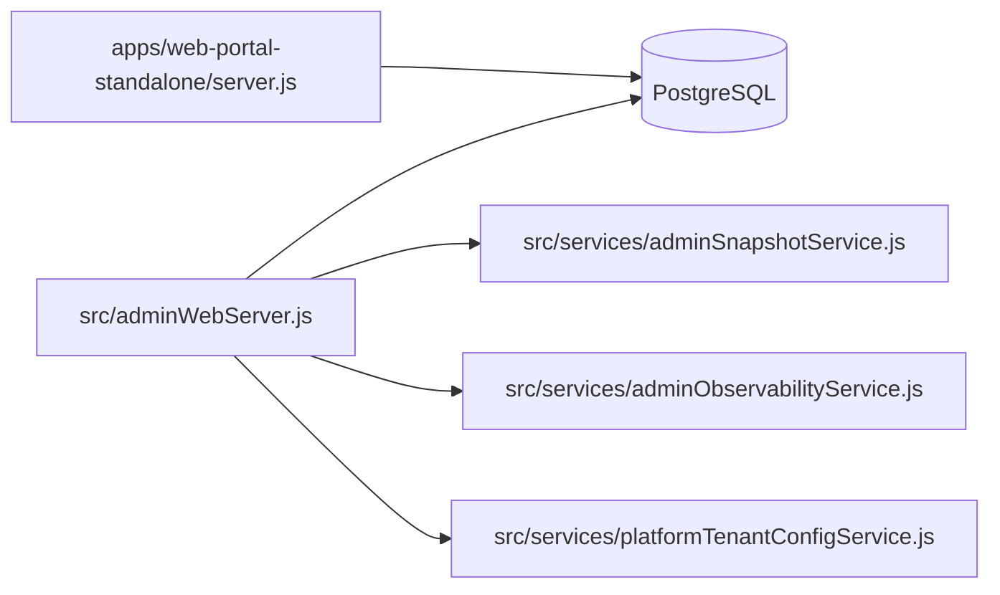

# Architecture Overview

This document describes the current architecture from the repository and active runtime model. It is intended to stay aligned with the code, not with historical deployment notes.

For verification status, see [VERIFICATION_STATUS_TH.md](./VERIFICATION_STATUS_TH.md).  
For feature-by-feature evidence, see [EVIDENCE_MAP_TH.md](./EVIDENCE_MAP_TH.md).
For exported visual assets, see [assets/README.md](./assets/README.md).

## Runtime Source Of Truth

Current production/runtime standard on this workstation:

- Primary runtime database: PostgreSQL
- ORM and schema toolchain: Prisma
- SQLite scope: local dev, import/compatibility paths, and offline tooling only

Do not describe SQLite as the active production runtime for this repository unless the deployment actually runs that path.

## Runtime Components

| Runtime       | Entry file                                                      | Main responsibility                                                          | Notes                                                           |
| ------------- | --------------------------------------------------------------- | ---------------------------------------------------------------------------- | --------------------------------------------------------------- |
| Discord bot   | `src/bot.js`                                                    | Discord gateway, command routing, admin web bootstrap, SCUM webhook receiver | Still a large bootstrap entrypoint                              |
| Worker        | `src/worker.js`                                                 | Delivery queue worker, rent bike runtime, background jobs                    | Split from bot runtime                                          |
| Watcher       | `src/services/scumLogWatcherRuntime.js`                         | Tail `SCUM.log`, parse events, send them to webhook                          | Can report `disabled` or `degraded` without exiting immediately |
| Console agent | `src/scum-console-agent.js`, `src/services/scumConsoleAgent.js` | Command bridge to SCUM admin client                                          | Optional runtime depending on execution mode                    |
| Admin web     | `src/adminWebServer.js`                                         | Admin API, auth, RBAC, backup/restore, observability, control panel          | Mounted from bot runtime                                        |
| Player portal | `apps/web-portal-standalone/server.js`                          | Player login, wallet, purchase history, redeem, profile, Steam link          | Deployable as a separate runtime                                |

## Runtime Topology

Exported diagram:


```mermaid
flowchart LR
  A[Discord] --> B[bot]
  C[Admin browser] --> D[admin web]
  E[Player browser] --> F[player portal]
  G[SCUM.log] --> H[watcher]
  H --> I[/scum-event webhook]
  I --> B
  J[worker] --> K[(PostgreSQL)]
  B --> K
  D --> K
  F --> K
```

## Delivery Path



Key files:

- `src/services/rconDelivery.js`
- `src/store/deliveryAuditStore.js`
- `src/store/deliveryEvidenceStore.js`
- `src/services/scumConsoleAgent.js`
- `test/rcon-delivery.integration.test.js`

What is implemented in this path:

- explicit execution backend per order
- persisted `executionMode`, `backend`, `commandPath`, `retryCount`
- preflight before enqueue in agent mode
- timeline, step log, audit, and evidence bundle
- agent circuit breaker and failover policy

## Event Ingestion Path



Key files:

- `src/services/scumLogWatcherRuntime.js`
- `src/scumWebhookServer.js`
- `test/scum-webhook.integration.test.js`

## Admin And Portal Surface



Key files:

- `src/adminWebServer.js`
- `src/services/adminSnapshotService.js`
- `src/services/adminAuditService.js`
- `src/services/adminObservabilityService.js`
- `src/services/platformTenantConfigService.js`
- `apps/web-portal-standalone/server.js`
- `test/admin-api.integration.test.js`

Current boundary notes:

- admin web covers a large part of the operational surface, but not every env/config key
- player portal is split from admin routes
- tenant scope is enforced across important admin/config paths, but not yet as full database isolation

## Data Layer

Production/runtime path:

- PostgreSQL
- provider-aware Prisma generate / migrate / push
- isolated provider-specific test database or schema per test run

Non-production or compatibility paths:

- SQLite for local dev convenience
- SQLite import/cutover source
- SQLite offline tooling when runtime database is not required

Key files:

- `src/prisma.js`
- `src/utils/dbEngine.js`
- `scripts/prisma-with-provider.js`
- `scripts/run-tests-with-provider.js`
- `scripts/cutover-sqlite-to-postgres.js`

## Tenant Boundary

Tenant scope is already present in:

- commerce and purchase rows
- delivery audit
- delivery evidence
- quota, billing, and subscription foundation
- tenant config API
- parts of admin scope

What is not finished yet:

- database-per-tenant
- broader DB-level isolation beyond the current PostgreSQL RLS strict mode on tenant-scoped platform tables
- complete tenant coverage across every admin/config collection

## Health, Readiness, And Smoke Boundaries

Exported contract diagram:


This exported view exists to explain how the repository now treats validation as one contract instead of unrelated script outputs. Local operators still read normal CLI text, but CI and follow-up tooling consume the same structured result shape.

Health endpoints:

- bot: `http://<BOT_HEALTH_HOST>:<BOT_HEALTH_PORT>/healthz`
- worker: `http://<WORKER_HEALTH_HOST>:<WORKER_HEALTH_PORT>/healthz`
- watcher: `http://<SCUM_WATCHER_HEALTH_HOST>:<SCUM_WATCHER_HEALTH_PORT>/healthz`
- console-agent: `http://<SCUM_CONSOLE_AGENT_HOST>:<SCUM_CONSOLE_AGENT_PORT>/healthz`
- admin web: `http://<ADMIN_WEB_HOST>:<ADMIN_WEB_PORT>/healthz`
- player portal: `http://<WEB_PORTAL_HOST>:<WEB_PORTAL_PORT>/healthz`

Main validation commands:

- `npm run doctor`
- `npm run doctor:topology:prod`
- `npm run doctor:web-standalone:prod`
- `npm run security:check`
- `npm run readiness:prod`
- `npm run smoke:postdeploy`

Current behavior:

- `readiness:prod` includes `smoke:postdeploy`
- required runtimes must be truly ready, not just reachable
- optional runtimes can be skipped or reported as disabled/degraded without failing the whole run

## Current Constraints

- `agent` execution still depends on Windows session state and a live SCUM client
- some SCUM command behavior depends on the target server
- restore should still be treated as a maintenance operation
- broader live runtime and in-game evidence still depends on additional capture passes, even though core screenshots, demo GIF output, and architecture assets now exist in `docs/assets/`

## Related Documents

- [README.md](../README.md)
- [PROJECT_HQ.md](../PROJECT_HQ.md)
- [CONFIG_MATRIX.md](./CONFIG_MATRIX.md)
- [MIGRATION_ROLLBACK_POLICY_TH.md](./MIGRATION_ROLLBACK_POLICY_TH.md)
- [LIMITATIONS_AND_SLA_TH.md](./LIMITATIONS_AND_SLA_TH.md)
- [adr/](./adr)
