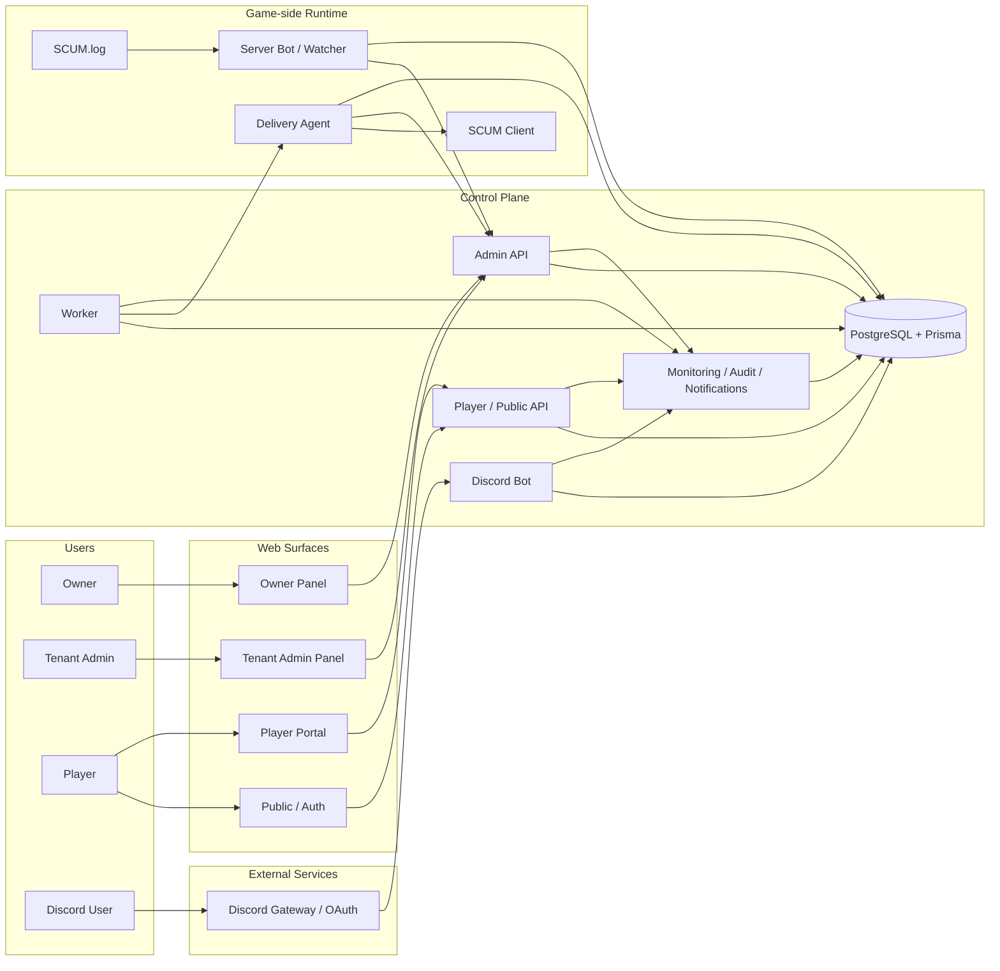
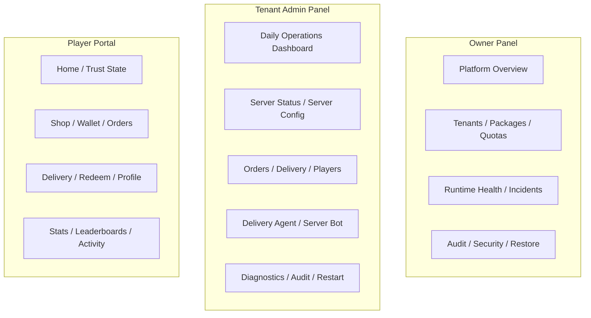
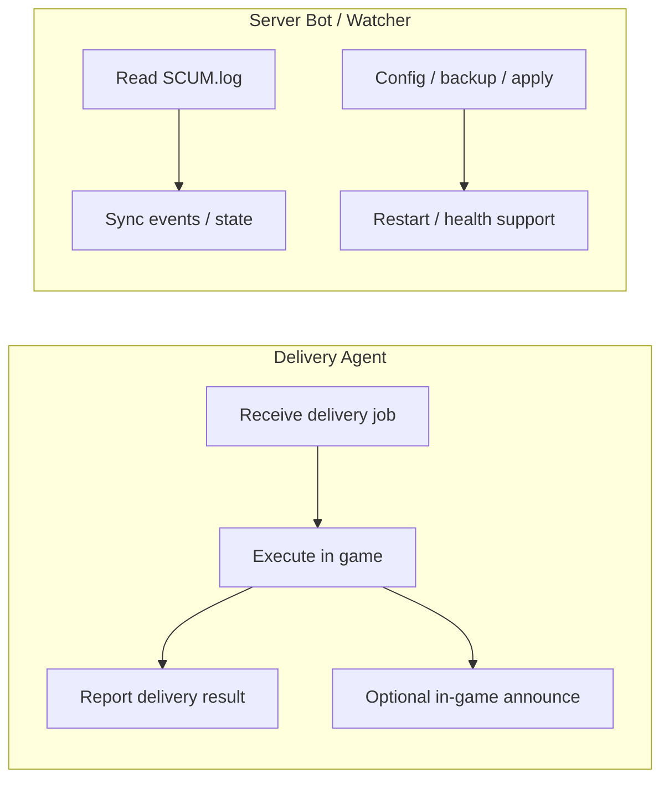
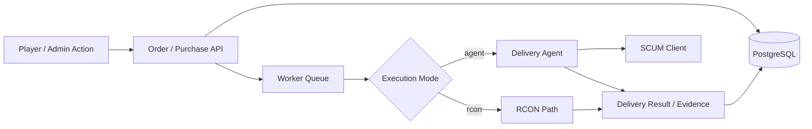
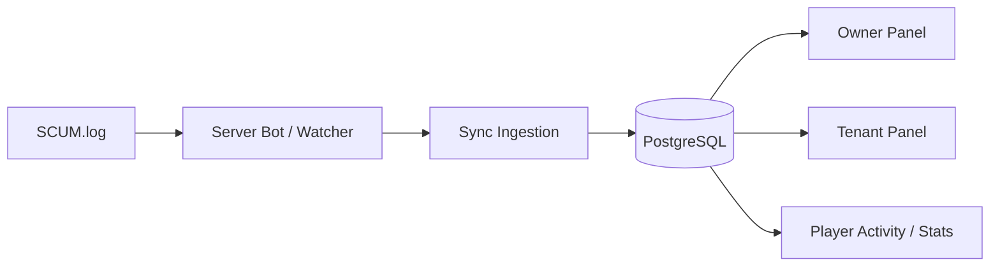
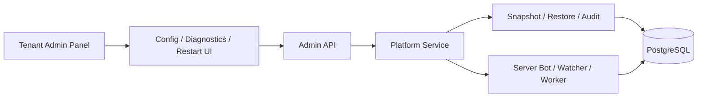

# System Map For GitHub

Last updated: **2026-03-27**

This document is written for GitHub-first viewing and uses Mermaid blocks that GitHub can render directly.
Its goal is to show the current platform shape in one place, with the main flows separated clearly enough for operators, reviewers, and contributors.

## 1. Platform Overview

## 2. Role Separation Across The Three Web Surfaces

## 3. Delivery Agent vs Server Bot

## 4. Order And Delivery Flow

## 5. Log, Sync, And Visibility Flow

## 6. Provisioning And Activation Flow

```mermaid
flowchart LR
  OWNER["Owner / Admin"] --> PROVISION["Provision Runtime"]
  PROVISION --> TOKEN["One-time Setup Token"]
  TOKEN --> RUNTIME["Agent / Bot Installer"]
  RUNTIME --> ACTIVATE["/platform/api/v1/agent/activate"]
  ACTIVATE --> BIND["Device Binding"]
  BIND --> CREDS["Long-lived Credential"]
  CREDS --> SESSION["Heartbeat / Session Refresh"]
  SESSION --> REGISTRY["Runtime Registry / Status"]
  REGISTRY --> OWNERVIEW["Owner / Tenant Runtime Views"]
```

## 7. Config, Diagnostics, And Restart Flow

## 8. Current System Inventory By Domain

### Web

- Owner Panel
- Tenant Admin Panel
- Public / Auth
- Player Portal

### Runtime

- Discord Bot
- Worker
- Server Bot / Watcher
- Delivery Agent

### Core Platform

- auth / RBAC / session
- package / feature gating
- tenant / preview / quota
- provisioning / activation / heartbeat / sync
- observability / audit / notifications / diagnostics

### Commerce And Community

- shop / cart / wallet / orders / delivery
- redeem / VIP / giveaways / events
- stats / leaderboards / tickets / moderation

### Data

- PostgreSQL
- Prisma
- schema-per-tenant topology

## 9. How To Read This Map

- Start with `Platform Overview` for the high-level system shape
- Use `Role Separation Across The Three Web Surfaces` to see how Owner, Tenant, and Player differ
- Use `Delivery Agent vs Server Bot` when reviewing runtime responsibilities
- Use the flow sections for the key paths: delivery, sync, provisioning, and config/restart

## Related Docs

- [SYSTEM_MAP_GITHUB_TH.md](./SYSTEM_MAP_GITHUB_TH.md)
- [ARCHITECTURE.md](./ARCHITECTURE.md)
- [RUNTIME_TOPOLOGY.md](./RUNTIME_TOPOLOGY.md)
- [PLATFORM_PACKAGE_AND_AGENT_MODEL.md](./PLATFORM_PACKAGE_AND_AGENT_MODEL.md)
- [PROJECT_HQ.md](../PROJECT_HQ.md)
