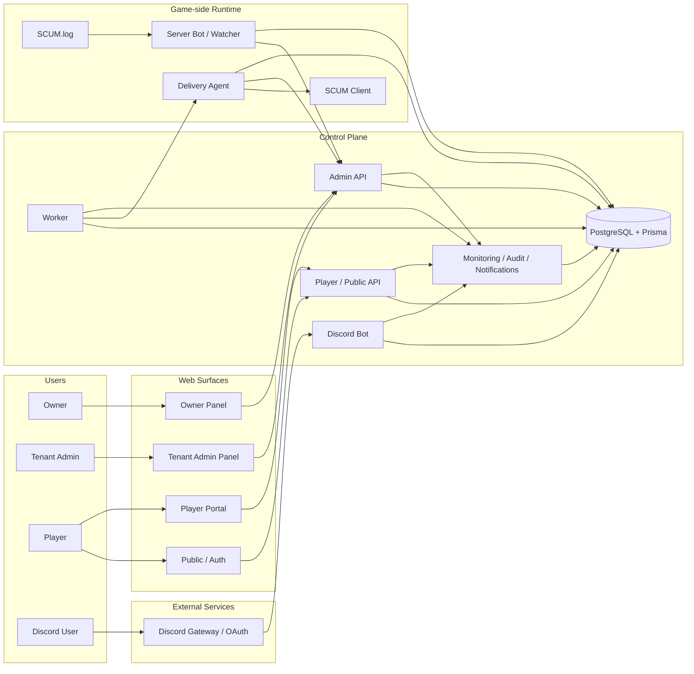
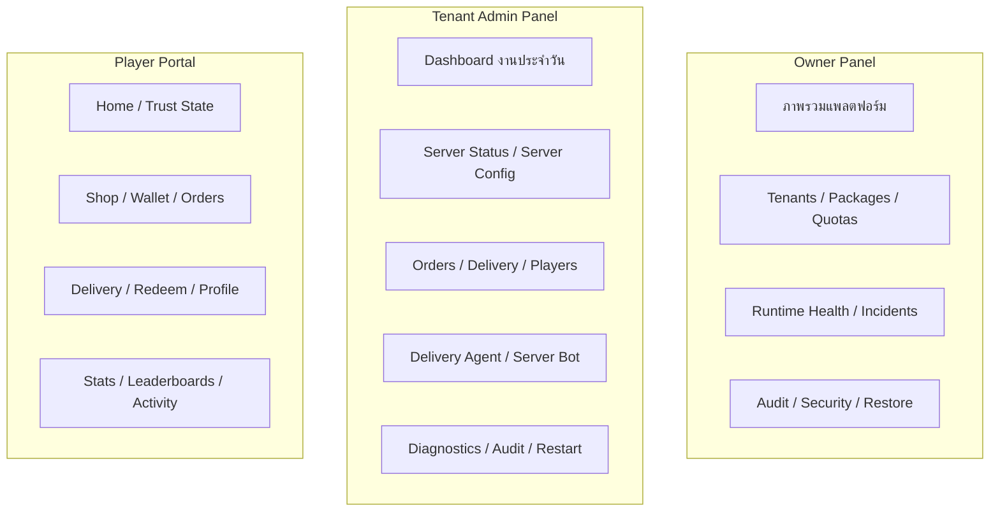
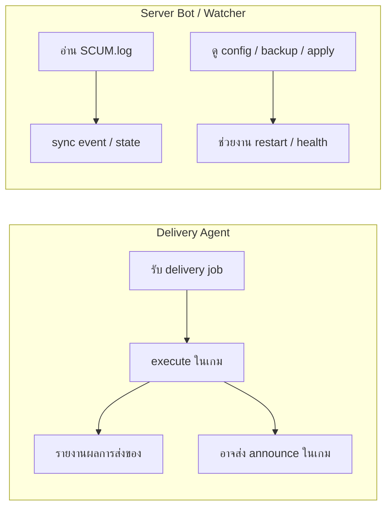
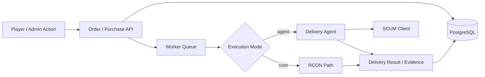
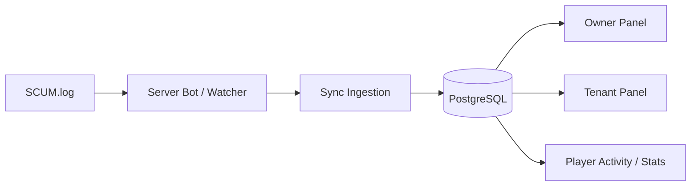
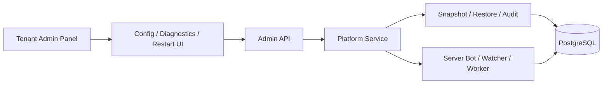

# System Map For GitHub

Last updated: **2026-03-27**

เอกสารนี้ทำไว้สำหรับดูบน GitHub โดยตรง และใช้ Mermaid ที่ GitHub เรนเดอร์ได้จริง
เป้าหมายคือให้เห็นภาพรวมระบบปัจจุบันแบบอ่านง่าย เร็ว และดูเป็นระบบ

## 1. ภาพรวมทั้งแพลตฟอร์ม

## 2. แยกบทบาทของเว็บทั้ง 3 ฝั่ง

## 3. เส้นแบ่งระหว่าง Delivery Agent และ Server Bot

## 4. เส้นทางคำสั่งซื้อและการส่งของ

## 5. เส้นทาง log, sync, และการมองเห็นเหตุการณ์

## 6. เส้นทาง provisioning และ activation

```mermaid
flowchart LR
  OWNER["Owner / Admin"] --> PROVISION["Provision Runtime"]
  PROVISION --> TOKEN["One-time Setup Token"]
  TOKEN --> RUNTIME["Agent / Bot Installer"]
  RUNTIME --> ACTIVATE["/platform/api/v1/agent/activate"]
  ACTIVATE --> BIND["Device Binding"]
  BIND --> CREDS["Long-lived Credential"]
  CREDS --> SESSION["Heartbeat / Session Refresh"]
  SESSION --> REGISTRY["Runtime Registry / Status"]
  REGISTRY --> OWNERVIEW["Owner / Tenant Runtime Views"]
```

## 7. เส้นทาง config, diagnostics, และ restart

## 8. ระบบที่มีอยู่ตอนนี้ แยกเป็นหมวด

### Web

- Owner Panel
- Tenant Admin Panel
- Public / Auth
- Player Portal

### Runtime

- Discord Bot
- Worker
- Server Bot / Watcher
- Delivery Agent

### Core Platform

- auth / RBAC / session
- package / feature gating
- tenant / preview / quota
- provisioning / activation / heartbeat / sync
- observability / audit / notifications / diagnostics

### Commerce And Community

- shop / cart / wallet / orders / delivery
- redeem / VIP / giveaways / events
- stats / leaderboards / tickets / moderation

### Data

- PostgreSQL
- Prisma
- schema-per-tenant topology

## 9. อ่านแผนผังนี้ยังไง

- ถ้าดูภาพรวมระบบ ให้เริ่มที่ `ภาพรวมทั้งแพลตฟอร์ม`
- ถ้าดูว่า `Owner`, `Tenant`, `Player` ต่างกันยังไง ให้ดู `แยกบทบาทของเว็บทั้ง 3 ฝั่ง`
- ถ้าดูว่า `Delivery Agent` กับ `Server Bot` ต่างกันยังไง ให้ดู `เส้นแบ่งระหว่าง Delivery Agent และ Server Bot`
- ถ้าดู flow สำคัญ ให้ดู `คำสั่งซื้อและการส่งของ`, `log/sync`, `provisioning`, และ `config/restart`

## Related Docs

- [SYSTEM_MAP_GITHUB_EN.md](./SYSTEM_MAP_GITHUB_EN.md)
- [ARCHITECTURE.md](./ARCHITECTURE.md)
- [RUNTIME_TOPOLOGY.md](./RUNTIME_TOPOLOGY.md)
- [PLATFORM_PACKAGE_AND_AGENT_MODEL.md](./PLATFORM_PACKAGE_AND_AGENT_MODEL.md)
- [PROJECT_HQ.md](../PROJECT_HQ.md)
