```mermaid
flowchart TD
  O["Owner Panel"] --> O1["Overview"]
  O --> O2["Tenants"]
  O --> O3["Packages"]
  O --> O4["Subscriptions"]
  O --> O5["Servers"]
  O --> O6["Delivery Agents"]
  O --> O7["Server Bots"]
  O --> O8["Jobs"]
  O --> O9["Logs & Audit"]
  O --> O10["Billing"]
  O --> O11["Support"]
  O --> O12["Security"]
  O --> O13["Feature Flags"]
  O --> O14["Settings"]

  O2 --> O21["Tenant List"]
  O2 --> O22["Tenant Detail"]
  O2 --> O23["Tenant Health"]
  O2 --> O24["Tenant Usage"]

  O3 --> O31["Package Catalog"]
  O3 --> O32["Package Detail"]
  O3 --> O33["Feature Mapping"]

  O4 --> O41["Subscription List"]
  O4 --> O42["Subscription Detail"]
  O4 --> O43["Expiring / Suspended"]

  O5 --> O51["Server Registry"]
  O5 --> O52["Server Detail"]
  O5 --> O53["Server Mapping"]

  O6 --> O61["Agent List"]
  O6 --> O62["Provision Delivery Agent"]
  O6 --> O63["Agent Detail"]

  O7 --> O71["Bot List"]
  O7 --> O72["Provision Server Bot"]
  O7 --> O73["Bot Detail"]

  O8 --> O81["Global Jobs"]
  O8 --> O82["Failed Jobs"]
  O8 --> O83["Job Detail"]

  O9 --> O91["Platform Logs"]
  O9 --> O92["Audit Log"]
  O9 --> O93["Incident Timeline"]

  O10 --> O101["Revenue Overview"]
  O10 --> O102["Billing History"]
  O10 --> O103["Usage Trends"]

  O11 --> O111["Support Queue"]
  O11 --> O112["Ticket Detail"]
  O11 --> O113["Diagnostics Bundles"]

  O12 --> O121["Security Overview"]
  O12 --> O122["Security Events"]
  O12 --> O123["Sessions & Access"]

  O13 --> O131["Feature Catalog"]
  O13 --> O132["Global Overrides"]

  O14 --> O141["Platform Settings"]
  O14 --> O142["Runtime Control"]
  O14 --> O143["Maintenance & Recovery"]
```

```mermaid
flowchart TD
  T["Tenant Admin Panel"] --> T1["Dashboard"]
  T --> T2["Subscription"]
  T --> T3["Servers"]
  T --> T4["Server Status"]
  T --> T5["Server Config"]
  T --> T6["Restart Control"]
  T --> T7["Delivery Agents"]
  T --> T8["Server Bots"]
  T --> T9["Diagnostics"]
  T --> T10["Logs & Sync"]
  T --> T11["Shop"]
  T --> T12["Orders"]
  T --> T13["Delivery"]
  T --> T14["Players"]
  T --> T15["Discord"]
  T --> T16["Donations"]
  T --> T17["Events"]
  T --> T18["Rewards"]
  T --> T19["Bot Modules"]
  T --> T20["Staff"]
  T --> T21["Settings"]
  T --> T22["Billing"]
  T --> T23["Help"]

  T3 --> T31["Server List"]
  T3 --> T32["Server Detail"]

  T5 --> T51["Config Overview"]
  T5 --> T52["Config Section"]
  T5 --> T53["Backup History"]
  T5 --> T54["Rollback"]

  T6 --> T61["Restart Now"]
  T6 --> T62["Delayed Restart"]
  T6 --> T63["Scheduled Restart"]
  T6 --> T64["Restart History"]

  T7 --> T71["Delivery Agent List"]
  T7 --> T72["Create Delivery Agent"]
  T7 --> T73["Delivery Agent Detail"]

  T8 --> T81["Server Bot List"]
  T8 --> T82["Create Server Bot"]
  T8 --> T83["Server Bot Detail"]

  T10 --> T101["Sync Health"]
  T10 --> T102["Event Feed"]
  T10 --> T103["Killfeed"]
  T10 --> T104["Config Changes"]

  T11 --> T111["Shop Overview"]
  T11 --> T112["Catalog"]
  T11 --> T113["Promo"]

  T12 --> T121["Order List"]
  T12 --> T122["Order Detail"]

  T13 --> T131["Delivery Queue"]
  T13 --> T132["Delivery Results"]
  T13 --> T133["Delivery Proof"]

  T14 --> T141["Player List"]
  T14 --> T142["Player Detail"]
  T14 --> T143["Wallet / Support"]

  T16 --> T161["Donation Overview"]
  T16 --> T162["Donation Packages"]
  T16 --> T163["Donation Rewards"]
  T16 --> T164["Donation History"]

  T17 --> T171["Event List"]
  T17 --> T172["Create Event"]
  T17 --> T173["Event Detail"]
  T17 --> T174["Event Results"]

  T19 --> T191["Module Center"]
  T19 --> T192["Dependencies"]
  T19 --> T193["Locked Features"]

  T23 --> T231["Help Center"]
  T23 --> T232["Support Tickets"]
  T23 --> T233["Diagnostics Export"]
```

```mermaid
flowchart TD
  P["Player Portal"] --> P1["Home"]
  P --> P2["Shop"]
  P --> P3["Wallet"]
  P --> P4["Orders"]
  P --> P5["Delivery"]
  P --> P6["My Stats"]
  P --> P7["Leaderboards"]
  P --> P8["Activity Feed"]
  P --> P9["Donations"]
  P --> P10["Events"]
  P --> P11["Profile"]
  P --> P12["Support"]

  P2 --> P21["Catalog"]
  P2 --> P22["Item Detail"]
  P2 --> P23["Cart / Checkout"]

  P4 --> P41["Order List"]
  P4 --> P42["Order Detail"]

  P5 --> P51["Delivery Status"]
  P5 --> P52["Delivery History"]

  P6 --> P61["Combat Stats"]
  P6 --> P62["Progress Stats"]

  P7 --> P71["Kills"]
  P7 --> P72["Headshots"]
  P7 --> P73["Longest Shot"]
  P7 --> P74["Donors"]
  P7 --> P75["Richest Wallet"]

  P8 --> P81["Killfeed"]
  P8 --> P82["Community Activity"]
  P8 --> P83["Announcements"]

  P9 --> P91["Top Supporters"]
  P9 --> P92["Donation Goals"]

  P10 --> P101["Active Events"]
  P10 --> P102["Upcoming Events"]
  P10 --> P103["Event History"]

  P11 --> P111["Account Profile"]
  P11 --> P112["Linked Accounts"]
  P11 --> P113["Verification Status"]

  P12 --> P121["Help Center"]
  P12 --> P122["Open Ticket"]
  P12 --> P123["My Tickets"]
```

# Web Surfaces V4 Sitemap

สถานะเอกสาร: draft พร้อมใช้เป็น page map หลัก  
อัปเดตล่าสุด: 2026-03-26  
อ้างอิงร่วม: [WEB_SURFACES_V4_BLUEPRINT_TH.md](./WEB_SURFACES_V4_BLUEPRINT_TH.md)

เอกสารนี้สรุป `site map + page list` ของ 3 เว็บหลักในระบบ:

- Owner Panel
- Tenant Admin Panel
- Player Portal

เป้าหมายคือให้ใช้เป็น:

- โครงเมนูจริง
- แผน route จริง
- page inventory สำหรับ design / backend / QA
- จุดอ้างอิงเวลารื้อจาก hash section ไปเป็น page-based IA

## หลักร่วมของทั้ง 3 เว็บ

ทุกเว็บใช้ shell pattern เดียวกัน:

- top bar
- left sidebar
- page header
- main content
- optional right rail

ทุกหน้าใน page list นี้ควรมี:

- ชื่อหน้า
- เป้าหมายของหน้า
- action หลัก 1 อย่าง
- empty state
- error state
- permission / feature gate

---

## 1. Owner Panel

### ภาพรวมบทบาท

Owner คือผู้ดูแลแพลตฟอร์มทั้งระบบ  
ไม่ใช่แอดมินเซิร์ฟเวอร์ราย tenant

### Route root

- `/owner`

### Sitemap

### Page list

| Route                                  | Page                     | เป้าหมาย                            | Primary action                    |
| -------------------------------------- | ------------------------ | ----------------------------------- | --------------------------------- |
| `/owner`                               | Overview                 | ดูสุขภาพแพลตฟอร์มรวม                | เปิด tenant/problem ที่ต้องจัดการ |
| `/owner/tenants`                       | Tenant List              | ดู tenant ทั้งหมด                   | สร้าง tenant                      |
| `/owner/tenants/:tenantId`             | Tenant Detail            | ดู tenant รายตัว                    | เปิดใช้งาน/แก้ tenant             |
| `/owner/tenants/:tenantId/health`      | Tenant Health            | ดู runtime, sync, issues ของ tenant | เปิด diagnostics                  |
| `/owner/packages`                      | Package Catalog          | จัดการ package                      | สร้าง/แก้ package                 |
| `/owner/packages/:packageId`           | Package Detail           | ดูรายละเอียด package                | บันทึก package                    |
| `/owner/packages/features`             | Feature Mapping          | ดู relation package-feature         | แก้ feature bundle                |
| `/owner/subscriptions`                 | Subscription List        | ดู subscription ทั้งระบบ            | ตรวจสถานะผิดปกติ                  |
| `/owner/subscriptions/:subscriptionId` | Subscription Detail      | ดู plan, billing, limits            | ต่ออายุ/ระงับ                     |
| `/owner/subscriptions/expiring`        | Expiring / Suspended     | ดูเคสใกล้หมดอายุ                    | เปิด tenant ที่เกี่ยวข้อง         |
| `/owner/servers`                       | Server Registry          | ดู server ทั้งหมด                   | เปิด server detail                |
| `/owner/servers/:serverId`             | Server Detail            | ดู owner-side server detail         | ตรวจ mapping                      |
| `/owner/servers/:serverId/mapping`     | Server Mapping           | ดู tenant/guild/agent map           | แก้ mapping                       |
| `/owner/delivery-agents`               | Delivery Agents          | ดู delivery agent ทั้งหมด           | provision delivery agent          |
| `/owner/delivery-agents/new`           | Provision Delivery Agent | สร้าง setup token / bootstrap       | สร้าง runtime                     |
| `/owner/delivery-agents/:agentId`      | Delivery Agent Detail    | ดูสถานะและ binding                  | reset binding / revoke            |
| `/owner/server-bots`                   | Server Bots              | ดู server bot ทั้งหมด               | provision server bot              |
| `/owner/server-bots/new`               | Provision Server Bot     | สร้าง setup token / bootstrap       | สร้าง runtime                     |
| `/owner/server-bots/:botId`            | Server Bot Detail        | ดูสถานะและ binding                  | reset binding / revoke            |
| `/owner/jobs`                          | Global Jobs              | ดูงานทั้งหมด                        | filter / inspect                  |
| `/owner/jobs/failed`                   | Failed Jobs              | ดูงานล้มเหลว                        | retry / investigate               |
| `/owner/jobs/:jobId`                   | Job Detail               | ดู execution history                | inspect evidence                  |
| `/owner/logs`                          | Platform Logs            | ดู log/platform events              | search/filter                     |
| `/owner/audit`                         | Audit Log                | ดู sensitive actions                | export audit                      |
| `/owner/incidents`                     | Incident Timeline        | ดู incident และ response            | เปิดเคสล่าสุด                     |
| `/owner/billing`                       | Revenue Overview         | ดูรายได้และ usage                   | เปิด billing detail               |
| `/owner/billing/history`               | Billing History          | ดูประวัติเรียกเก็บเงิน              | export                            |
| `/owner/billing/usage`                 | Usage Trends             | ดู usage trend                      | compare periods                   |
| `/owner/support`                       | Support Queue            | ดู ticket ทั้งหมด                   | เปิด ticket                       |
| `/owner/support/:ticketId`             | Ticket Detail            | จัดการเคสซัพพอร์ต                   | ตอบกลับ / ปิดเคส                  |
| `/owner/support/diagnostics`           | Diagnostics Bundles      | ดู bundle ที่ส่งเข้ามา              | ดาวน์โหลด bundle                  |
| `/owner/security`                      | Security Overview        | ดู security posture                 | เปิด security events              |
| `/owner/security/events`               | Security Events          | ดูเหตุการณ์ด้านความปลอดภัย          | export / filter                   |
| `/owner/security/access`               | Sessions & Access        | ดู session / access issues          | revoke session                    |
| `/owner/feature-flags`                 | Feature Catalog          | ดู feature ทั้งระบบ                 | เปิด override                     |
| `/owner/feature-flags/overrides`       | Global Overrides         | จัดการ global override              | save override                     |
| `/owner/settings`                      | Platform Settings        | ตั้งค่าระดับแพลตฟอร์ม               | save settings                     |
| `/owner/settings/runtime`              | Runtime Control          | ดู runtime control                  | apply / restart                   |
| `/owner/settings/maintenance`          | Maintenance & Recovery   | recovery / restore / rollback       | start restore                     |

---

## 2. Tenant Admin Panel

### ภาพรวมบทบาท

Tenant Admin คือผู้ดูแลเซิร์ฟเวอร์ของลูกค้าแต่ละราย  
เป้าหมายคือทำงานประจำวันให้เสร็จเร็วและชัด

### Route root

- `/tenant`

### Sitemap

### Page list

| Route                              | Page                  | เป้าหมาย                   | Primary action        |
| ---------------------------------- | --------------------- | -------------------------- | --------------------- |
| `/tenant`                          | Dashboard             | ดูภาพรวมงานประจำวัน        | ใช้ quick actions     |
| `/tenant/subscription`             | Subscription          | ดู package/limits          | upgrade package       |
| `/tenant/servers`                  | Server List           | ดูเซิร์ฟเวอร์ที่ดูแล       | เปิด server detail    |
| `/tenant/servers/:serverId`        | Server Detail         | ดู server รายตัว           | เปิด config/status    |
| `/tenant/status`                   | Server Status         | ดู health, uptime, sync    | investigate issue     |
| `/tenant/config`                   | Config Overview       | เริ่มจัดการ config         | เปิด section          |
| `/tenant/config/:sectionKey`       | Config Section        | แก้ค่าใน section           | save / save+apply     |
| `/tenant/config/backups`           | Backup History        | ดู backup config           | restore               |
| `/tenant/config/rollback`          | Rollback              | rollback config            | confirm rollback      |
| `/tenant/restart`                  | Restart Control       | จัดการ restart             | restart now / delayed |
| `/tenant/restart/schedule`         | Scheduled Restart     | ตั้ง restart ล่วงหน้า      | schedule restart      |
| `/tenant/restart/history`          | Restart History       | ดูประวัติ restart          | inspect run           |
| `/tenant/delivery-agents`          | Delivery Agent List   | ดูเอเจนต์ส่งของ            | create delivery agent |
| `/tenant/delivery-agents/new`      | Create Delivery Agent | สร้าง setup token          | provision runtime     |
| `/tenant/delivery-agents/:agentId` | Delivery Agent Detail | ดู binding / status        | reset binding         |
| `/tenant/server-bots`              | Server Bot List       | ดูบอตเซิร์ฟเวอร์           | create server bot     |
| `/tenant/server-bots/new`          | Create Server Bot     | สร้าง setup token          | provision runtime     |
| `/tenant/server-bots/:botId`       | Server Bot Detail     | ดู binding / status        | reset binding         |
| `/tenant/diagnostics`              | Diagnostics           | ดูสภาพระบบ                 | export diagnostics    |
| `/tenant/logs`                     | Sync Health           | ดู freshness/sync errors   | filter                |
| `/tenant/logs/events`              | Event Feed            | ดู event feed              | search                |
| `/tenant/logs/killfeed`            | Killfeed              | ดู kill/combat feed        | date filter           |
| `/tenant/logs/config-changes`      | Config Changes        | ดูประวัติเปลี่ยน config    | open audit            |
| `/tenant/shop`                     | Shop Overview         | ดูภาพรวมร้านค้า            | open catalog          |
| `/tenant/shop/catalog`             | Catalog               | จัดการสินค้า               | create item           |
| `/tenant/shop/promo`               | Promo                 | จัดการโปรโมชัน             | create promo          |
| `/tenant/orders`                   | Order List            | ดูออเดอร์ทั้งหมด           | open order            |
| `/tenant/orders/:orderId`          | Order Detail          | ดูออเดอร์รายตัว            | retry / support       |
| `/tenant/delivery`                 | Delivery Queue        | ดู queue ส่งของ            | inspect failed jobs   |
| `/tenant/delivery/results`         | Delivery Results      | ดูผลการส่งของ              | filter results        |
| `/tenant/delivery/proofs`          | Delivery Proof        | ดู evidence/proof          | open proof            |
| `/tenant/players`                  | Player List           | ดูผู้เล่นทั้งหมด           | open player           |
| `/tenant/players/:playerId`        | Player Detail         | ดูข้อมูลรายคน              | support player        |
| `/tenant/players/:playerId/wallet` | Wallet / Support      | ดู wallet/history          | adjust / inspect      |
| `/tenant/discord`                  | Discord               | ผูก/ดู Discord integration | link Discord          |
| `/tenant/donations`                | Donation Overview     | ดู donation summary        | create package        |
| `/tenant/donations/packages`       | Donation Packages     | จัดการแพ็กเกจโดเนต         | create package        |
| `/tenant/donations/rewards`        | Donation Rewards      | จัดการ reward              | save rewards          |
| `/tenant/donations/history`        | Donation History      | ดูประวัติโดเนต             | export                |
| `/tenant/events`                   | Event List            | ดู event ทั้งหมด           | create event          |
| `/tenant/events/new`               | Create Event          | สร้าง event                | save event            |
| `/tenant/events/:eventId`          | Event Detail          | ดูรายละเอียด event         | edit / announce       |
| `/tenant/events/:eventId/results`  | Event Results         | ดูผล event                 | publish results       |
| `/tenant/rewards`                  | Rewards               | จัดการ reward rules        | save rewards          |
| `/tenant/modules`                  | Module Center         | เปิด-ปิด modules           | toggle module         |
| `/tenant/modules/dependencies`     | Dependencies          | ดู dependencies            | resolve blockers      |
| `/tenant/modules/locked`           | Locked Features       | ดู feature ที่ยังล็อก      | upgrade package       |
| `/tenant/staff`                    | Staff                 | ดู staff/roles             | invite staff          |
| `/tenant/settings`                 | Settings              | ตั้งค่าระดับ tenant        | save settings         |
| `/tenant/billing`                  | Billing               | ดูค่าใช้จ่าย               | inspect invoice       |
| `/tenant/help`                     | Help Center           | ดูคู่มือและจุดช่วยเหลือ    | open support ticket   |
| `/tenant/help/tickets`             | Support Tickets       | ดู ticket ของ tenant       | create ticket         |
| `/tenant/help/diagnostics`         | Diagnostics Export    | ส่ง bundle ช่วยซัพพอร์ต    | export bundle         |

---

## 3. Player Portal

### ภาพรวมบทบาท

Player Portal คือหน้าของผู้เล่นและชุมชน  
ต้องกลับมาใช้งานซ้ำได้ ไม่ใช่แค่ร้านค้า

### Route root

- `/player`

### Sitemap

### Page list

| Route                               | Page                | เป้าหมาย                   | Primary action        |
| ----------------------------------- | ------------------- | -------------------------- | --------------------- |
| `/player`                           | Home                | ดูสิ่งสำคัญทันที           | ไปยัง task หลัก       |
| `/player/shop`                      | Catalog             | ซื้อของ                    | เปิด item detail      |
| `/player/shop/:itemId`              | Item Detail         | ดู item รายตัว             | add to cart / buy     |
| `/player/cart`                      | Cart / Checkout     | ตรวจของก่อนซื้อ            | checkout              |
| `/player/wallet`                    | Wallet              | ดูยอดเงินและประวัติ        | top up                |
| `/player/orders`                    | Order List          | ดูออเดอร์ทั้งหมด           | open order            |
| `/player/orders/:orderId`           | Order Detail        | ดูสถานะออเดอร์             | inspect next step     |
| `/player/delivery`                  | Delivery Status     | ดูการส่งของล่าสุด          | inspect proof/status  |
| `/player/delivery/history`          | Delivery History    | ดูประวัติส่งของ            | filter                |
| `/player/stats`                     | Combat Stats        | ดูสถิติส่วนตัว             | compare               |
| `/player/stats/progress`            | Progress Stats      | ดูความคืบหน้า / milestone  | review progress       |
| `/player/leaderboards`              | Kills               | เปิด leaderboard หลัก      | change category       |
| `/player/leaderboards/headshots`    | Headshots           | ดูอันดับ headshots         | compare               |
| `/player/leaderboards/longest-shot` | Longest Shot        | ดูอันดับยิงไกล             | compare               |
| `/player/leaderboards/donors`       | Top Donors          | ดูผู้สนับสนุนสูงสุด        | inspect supporters    |
| `/player/leaderboards/wallet`       | Richest Wallet      | ดูอันดับเงินในระบบ         | compare               |
| `/player/activity`                  | Killfeed            | ดู activity ล่าสุด         | filter feed           |
| `/player/activity/community`        | Community Activity  | ดูกิจกรรมชุมชน             | inspect               |
| `/player/activity/announcements`    | Announcements       | ดูประกาศ                   | read latest           |
| `/player/donations`                 | Top Supporters      | ดู supporter area          | support server        |
| `/player/donations/goals`           | Donation Goals      | ดูเป้าหมายโดเนต            | contribute            |
| `/player/events`                    | Active Events       | ดู event ที่กำลังเปิด      | open event            |
| `/player/events/upcoming`           | Upcoming Events     | ดู event ที่กำลังจะมา      | follow                |
| `/player/events/history`            | Event History       | ดู event ที่ผ่านมา         | inspect results       |
| `/player/profile`                   | Account Profile     | ดูข้อมูลบัญชี              | edit profile          |
| `/player/profile/linked-accounts`   | Linked Accounts     | ดู Discord/Steam links     | link account          |
| `/player/profile/verification`      | Verification Status | ดูสถานะการยืนยันตัวตน      | complete verification |
| `/player/support`                   | Help Center         | ดูคำตอบและช่องทางช่วยเหลือ | open ticket           |
| `/player/support/new`               | Open Ticket         | เปิด ticket ใหม่           | submit ticket         |
| `/player/support/tickets`           | My Tickets          | ดู ticket ของตัวเอง        | open ticket detail    |

---

## 4. Shared auth / public flows

แม้เอกสารนี้โฟกัส 3 เว็บหลัก แต่ต้องมี flow กลางรองรับด้วย

### Public / auth pages

| Route              | Page            | เป้าหมาย           |
| ------------------ | --------------- | ------------------ |
| `/landing`         | Landing         | อธิบายผลิตภัณฑ์    |
| `/pricing`         | Pricing         | เปรียบเทียบแพ็กเกจ |
| `/signup`          | Sign Up         | สมัครใช้งานเองได้  |
| `/login`           | Login           | เข้าระบบ           |
| `/forgot-password` | Forgot Password | รีเซ็ตรหัสผ่าน     |
| `/verify-email`    | Verify Email    | ยืนยันอีเมล        |
| `/preview`         | Preview Mode    | ดูระบบก่อนซื้อ     |
| `/checkout`        | Checkout        | สมัคร package      |
| `/payment-result`  | Payment Result  | ดูผลการชำระเงิน    |

---

## 5. Mapping จากของเดิมในโปรเจกต์

ตอนนี้ของเดิมในโปรเจกต์ยังมี hash route เก่าอยู่หลายส่วน เช่น:

- `/owner#security`
- `/owner#control`
- `/tenant#commerce`
- `/tenant#players`

การย้ายไป sitemap ใหม่นี้ควรทำแบบ staged:

1. route ใหม่ทำงานก่อน
2. hash เดิม redirect ไป route ใหม่
3. section stack เดิมค่อยเลิกใช้

ตัวอย่าง:

- `/owner#security` -> `/owner/security`
- `/owner#incidents` -> `/owner/incidents`
- `/tenant#config` -> `/tenant/config`
- `/tenant#actions` -> `/tenant/restart`
- `/tenant#players` -> `/tenant/players`

---

## 6. ลำดับทำจริงที่แนะนำ

ถ้าจะเริ่ม implement จาก page map นี้:

1. Tenant Dashboard
2. Tenant Status
3. Tenant Config
4. Tenant Restart
5. Tenant Orders / Delivery / Players
6. Owner Overview
7. Owner Tenants / Jobs / Security
8. Player Home / Wallet / Orders / Profile

เหตุผล:

- Tenant เป็นเว็บที่ใช้งานรายวันมากที่สุด
- Owner ใช้งานเชิงดูแลระบบและต้องรอ data model บางส่วน
- Player ต้องตามหลัง data feeds และ community surfaces
