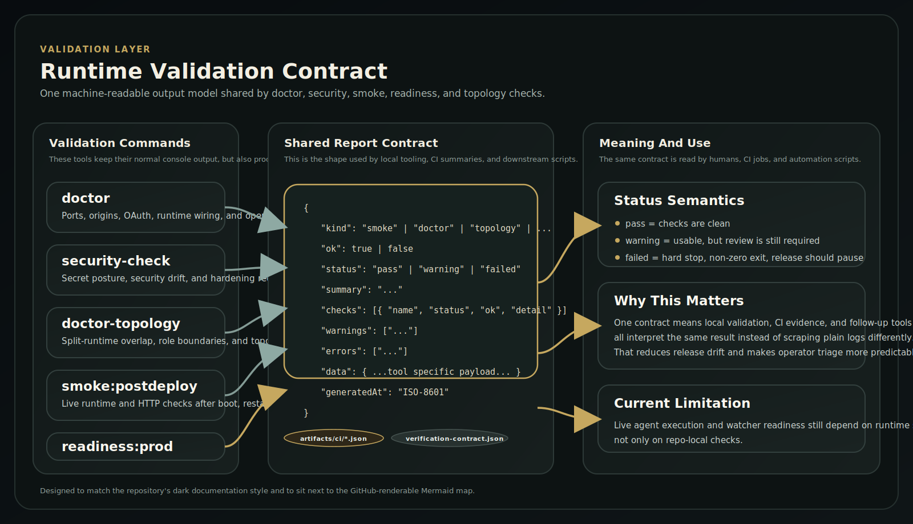
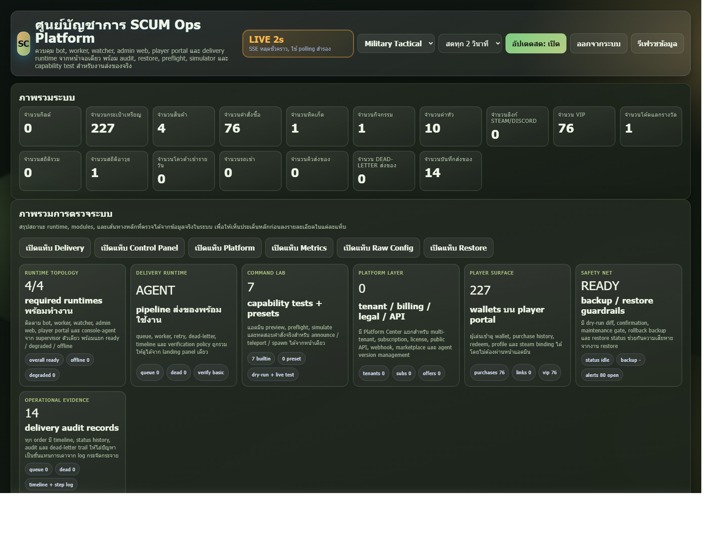
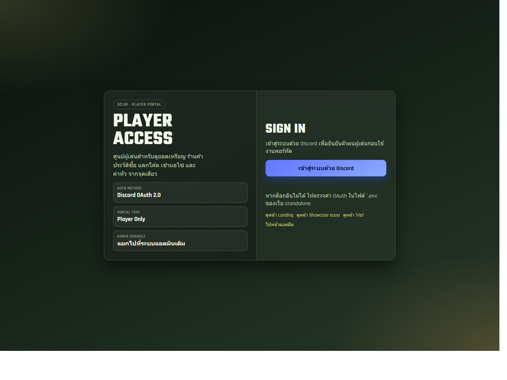
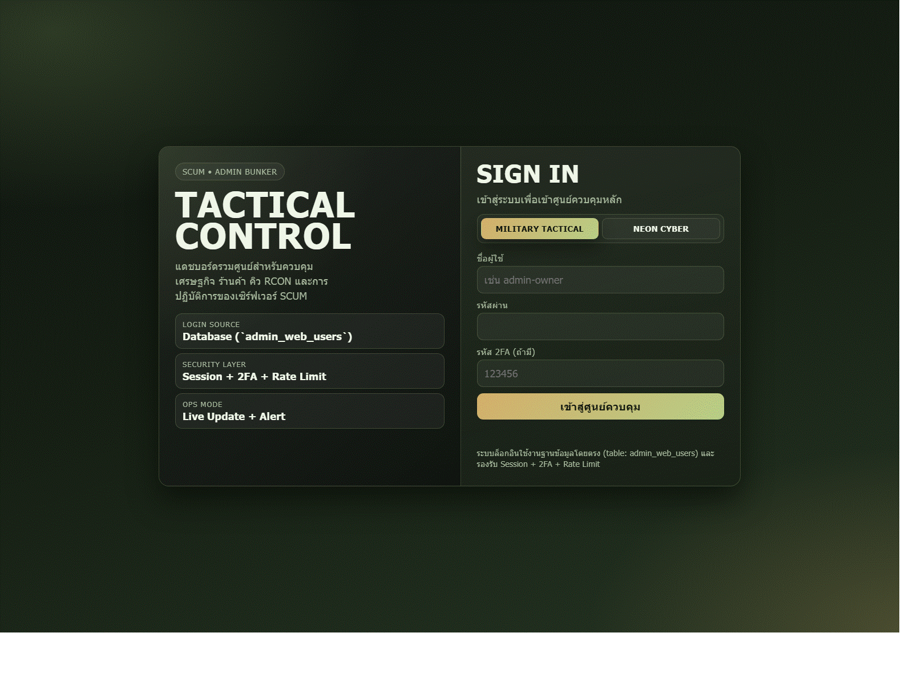

# Visual Assets

This folder contains the visual artifacts used by the repository docs.  
Think of it as the gallery for architecture maps, surface captures, and live proof evidence.

## Recommended Reading Order

If someone is new to this repository, this order gives the fastest path from high-level understanding to runtime evidence:

1. [architecture-overview.svg](./architecture-overview.svg)
   - Start here to understand the platform shape, the three web surfaces, the control plane, and the game-side runtimes.
2. [runtime-validation-contract.svg](./runtime-validation-contract.svg)
   - Read this next to understand how validation, CI, and operator checks share one result contract.
3. [admin-login.png](./admin-login.png)
   - Use this to see the first operator entry point.
4. [admin-dashboard.png](./admin-dashboard.png)
   - Then look at the main admin surface to understand the operational context.
5. [player-landing.png](./player-landing.png)
   - Switch to the public/player side to see the customer-facing entry.
6. [player-login.png](./player-login.png)
   - Continue into the player authentication flow.
7. [player-dashboard.png](./player-dashboard.png)
   - Then inspect the main player workspace.
8. [player-showcase.png](./player-showcase.png)
   - Use this to understand the richer player-facing presentation layer.
9. [platform-demo.gif](./platform-demo.gif)
   - Watch this after the still captures if you want a quick visual walkthrough.
10. [live-runtime-evidence.md](./live-runtime-evidence.md)
    - Move here when you want machine/runtime evidence instead of UI context.
11. Native-proof matrices and environment coverage files
    - Use these last when you need delivery-proof depth, workstation evidence, or server-configuration coverage.

## Architecture Maps

### Platform architecture

[architecture-overview.svg](./architecture-overview.svg)

### Validation contract

[runtime-validation-contract.svg](./runtime-validation-contract.svg)

## Web Surface Captures

### Admin login

[admin-login.png](./admin-login.png)

### Admin dashboard

[admin-dashboard.png](./admin-dashboard.png)

### Player landing

[player-landing.png](./player-landing.png)

### Player login

[player-login.png](./player-login.png)

### Player dashboard

[player-dashboard.png](./player-dashboard.png)

### Player showcase

[player-showcase.png](./player-showcase.png)

### Demo GIF

[platform-demo.gif](./platform-demo.gif)

## Runtime And Native-Proof Evidence

### Narrative evidence

- [live-runtime-evidence.md](./live-runtime-evidence.md)
- [CAPTURE_CHECKLIST.md](./CAPTURE_CHECKLIST.md)

### Native-proof matrices

- [live-native-proof-matrix.md](./live-native-proof-matrix.md)
- [live-native-proof-matrix.json](./live-native-proof-matrix.json)
- [live-native-proof-wrapper-matrix.md](./live-native-proof-wrapper-matrix.md)
- [live-native-proof-wrapper-matrix.json](./live-native-proof-wrapper-matrix.json)
- [live-native-proof-enable-spawn-on-ground-matrix.md](./live-native-proof-enable-spawn-on-ground-matrix.md)
- [live-native-proof-enable-spawn-on-ground-matrix.json](./live-native-proof-enable-spawn-on-ground-matrix.json)
- [live-native-proof-enable-spawn-on-ground-retry.md](./live-native-proof-enable-spawn-on-ground-retry.md)
- [live-native-proof-enable-spawn-on-ground-retry.json](./live-native-proof-enable-spawn-on-ground-retry.json)
- [live-native-proof-rcon-attempt.md](./live-native-proof-rcon-attempt.md)
- [live-native-proof-rcon-attempt.json](./live-native-proof-rcon-attempt.json)

### Coverage and environment tracking

- [live-native-proof-environments.json](./live-native-proof-environments.json)
- [live-native-proof-coverage-summary.md](./live-native-proof-coverage-summary.md)
- [live-native-proof-coverage-summary.json](./live-native-proof-coverage-summary.json)
- [live-native-proof-cases.json](./live-native-proof-cases.json)
- [live-native-proof-experimental-cases.json](./live-native-proof-experimental-cases.json)

## What Is Still Missing

- broader native delivery proof coverage across more server configurations and more than one workstation
- passing proof for experimental item IDs still tracked in `live-native-proof-experimental-cases.json`

## Capture Workflow

- `npm run docs:capture-evidence`
- `npm run docs:build-demo-gif`
- the current capture flow exports local admin login, authenticated admin dashboard, player landing, player login, authenticated player dashboard, and player showcase
- the current Windows capture flow also builds `platform-demo.gif`
- delivery-class proof expectations are documented in [../DELIVERY_NATIVE_PROOF_COVERAGE.md](../DELIVERY_NATIVE_PROOF_COVERAGE.md)
